# 🏸 SmashBook — Phân tích & Thiết kế Hệ thống Đặt lịch Sân Cầu lông

> **Phiên bản:** 1.0 — 02/10/2026
> **Mục đích:** Tài liệu duy nhất (single source of truth) để **Antigravity Agent** viết code. Gồm phân tích **hướng chức năng** (BFD, DFD, từ điển dữ liệu) và **hướng đối tượng** (Use case, Class, Sequence, Activity, State), thiết kế dữ liệu, API, thuật toán lõi, UI/UX và kế hoạch triển khai theo milestone.
> **Công nghệ:** theo `tech-stack-template.md` (Next.js 14 App Router · TypeScript · Prisma · PostgreSQL/Supabase · Redis · Auth.js v5 · Tailwind · Zustand · TanStack Query · Zod …), kèm các điều chỉnh ở §3.2.
> **Tên thương hiệu `SmashBook` là tên tạm** — đặt trong `src/lib/config/brand.ts` để đổi một chỗ.

---

## Mục lục

0. Hướng dẫn dành cho Agent (đọc trước)
1. Tổng quan
2. Phân tích yêu cầu
3. Công nghệ & kiến trúc
4. Phân tích hướng chức năng
5. Phân tích hướng đối tượng
6. Thiết kế dữ liệu
7. Thiết kế API & tích hợp
8. Thuật toán lõi
9. Thiết kế UI/UX
10. Bảo mật, kiểm thử, triển khai
11. Kế hoạch triển khai (Milestones)
12. Phụ lục

---

## 0. Hướng dẫn dành cho Agent (đọc trước)

**Mục tiêu:** xây website đặt lịch sân cầu lông: khách tìm cơ sở → xem lịch trống dạng lưới (sân × giờ) → chọn giờ → thanh toán → nhận xác nhận; chủ sân quản lý sân, giá, lịch, doanh thu; admin quản trị hệ thống.

**Nguồn sự thật (khi có mâu thuẫn, ưu tiên theo thứ tự):**
1. §2.3 Quy tắc nghiệp vụ (BR-xx) và §6 Thiết kế dữ liệu
2. §8 Thuật toán lõi
3. §7 API
4. §9 UI/UX (token ở §9.2)
5. Các sơ đồ (minh hoạ)

**Quy tắc làm việc:**
- Làm tuần tự theo **Milestone ở §11**. Sau mỗi milestone chạy `npm run lint && npx tsc --noEmit && npm run build`, tóm tắt thay đổi rồi **dừng chờ xác nhận**.
- **Không thêm package ngoài danh sách ở §3.1 và §3.2** khi chưa hỏi.
- Gặp điểm mơ hồ → dùng quyết định mặc định ở §2.4 và để lại comment `// TODO(decision): ...`.
- TypeScript `strict`, không dùng `any`. Validate **mọi** input bằng Zod (schema dùng chung FE/BE ở `src/lib/validators`).
- Mọi chuỗi giao diện bằng **tiếng Việt**; định danh trong code bằng **tiếng Anh**.
- **Không bao giờ** tin dữ liệu giá/tổng tiền từ client — luôn tính lại ở server.
- Không sao chép logo, ảnh, banner, nội dung, số điện thoại hay tên cơ sở thật của bất kỳ nền tảng nào; dùng dữ liệu seed giả ở §12.2.

**Prompt khởi động gợi ý (dán vào Antigravity):**
```
Đọc toàn bộ file badminton-booking-spec.md. Bắt đầu từ Milestone M0 ở §11.
Sau mỗi milestone: chạy lint + tsc + build, tóm tắt thay đổi, rồi chờ tôi xác nhận.
Gặp điểm mơ hồ thì chọn phương án mặc định ở §2.4 và ghi TODO(decision).
```

---

## 1. Tổng quan

### 1.1 Bối cảnh & mục tiêu
Người chơi cầu lông thường đặt sân qua điện thoại/Zalo, mất thời gian hỏi giờ trống và dễ trùng lịch. Hệ thống số hoá quy trình: **xem lịch trống theo thời gian thực, giữ chỗ, thanh toán online, quản lý lịch cho chủ sân**.

Mục tiêu đo được:
- Đặt xong một lượt trong **≤ 5 thao tác** từ trang chủ.
- **Không bao giờ** trùng lịch (kể cả 50 yêu cầu song song vào cùng một ô).
- Trang danh sách và lưới lịch dùng tốt trên điện thoại (mobile-first).

### 1.2 Phạm vi

| Phase | Nội dung |
|---|---|
| **MVP (Phase 1)** | Tài khoản & xác thực · Tìm kiếm/lọc/bản đồ · Chi tiết cơ sở & bảng giá · Lưới đặt sân · Giữ chỗ · Voucher · Thanh toán VNPAY (+ trả tại sân) · Lịch đã đặt & huỷ · Thông báo in-app/email · Đánh giá · Yêu thích · Dashboard chủ sân (sân, giá, lịch, đặt hộ, khoá sân, báo cáo) · Admin cơ bản |
| **Phase 2** | Giao lưu/Social (xé vé) & trang Khám phá · Gói hội viên & điểm thưởng · Đặt lịch cố định (định kỳ) · Web push · MoMo/Stripe · Đa ngôn ngữ (vi/en) · Realtime SSE |

### 1.3 Tham chiếu giao diện: phân tích nền tảng đặt sân hiện có
Các ảnh chụp màn hình tham khảo cho thấy các màn hình và hành vi sau. Cột phải là **cải tiến/khác biệt** của SmashBook (yêu cầu: đổi màu, bố cục khác một chút).

| Màn hình tham khảo | Quan sát | SmashBook làm khác/tốt hơn |
|---|---|---|
| Trang chủ | Header lời chào + thanh tìm kiếm + 4 lối tắt (Bản đồ, Sân đã đặt, Yêu thích); banner; lưới thẻ cơ sở (ảnh, sao, nhãn "Đơn ngày/Sự kiện", khoảng cách, giờ mở, nút Đặt lịch, nút xám khi đóng cửa) | Hero có **ô tìm theo khu vực + ngày + giờ** (tìm được cơ sở *còn trống*); lối tắt thành chip lọc nhanh; thẻ cơ sở thêm **giá từ** và **trạng thái "còn trống tối nay"** |
| Chọn hình thức đặt | Modal 2 lựa chọn: đặt theo sân (trực quan) / mua vé social | Bỏ modal; trang chi tiết cơ sở có **tab** và một nút đặt chính; Social là tab ở Phase 2 |
| Lưới đặt sân | Cột giờ 5:00–22:00 mỗi 30', hàng là sân; màu Trống/Đã đặt/Khoá/Sự kiện; thanh zoom; chỉ có nút "Tiếp theo" | Thêm **thanh tóm tắt cố định** (số ô, tổng tiền tạm tính), **đường "Bây giờ"**, **ký hiệu hoạ tiết ngoài màu** (hỗ trợ mù màu), kéo-để-chọn, trên mobile **đảo trục** (giờ theo hàng, sân theo cột) |
| Bảng giá | Bảng Thứ × Khung giờ × giá **Cố định** / **Vãng lai** | Giữ khái niệm 2 loại giá; hiển thị ngay trong tab "Bảng giá" và tô nổi khung giờ hiện tại |
| Bản đồ | Bản đồ + chip lọc môn thể thao + ô tìm quanh đây + nút định vị + nút danh sách | Giữ; thêm **thẻ cơ sở dạng bottom sheet** khi chọn ghim, lọc theo giá/tiện ích |
| Khám phá | Tab Tất cả/Sự kiện/Gói hội viên/Khóa học/Thông báo/Ưu đãi/Pass sân; thẻ sự kiện xé vé | Phase 2 |
| Nổi bật | Lưới banner khuyến mãi của cơ sở | Phase 2 (mục "Ưu đãi") |
| Tài khoản | Hồ sơ, hạng thành viên, lối tắt (Lịch đã đặt, Thông báo, Ưu đãi), Hoạt động, Hệ thống; banner "liên kết email để lấy lại mật khẩu"; danh sách đặt lịch có trạng thái "Đã xác nhận" | Giữ ý tưởng **banner thêm email để khôi phục mật khẩu**; lịch đã đặt chia tab Sắp tới / Đã chơi / Đã huỷ, có mã đặt & QR |
| Đăng nhập / Đăng ký | Tab SĐT/Email, mật khẩu, Google; đăng ký gồm SĐT, email (tuỳ chọn), họ tên, mật khẩu, nhập lại | Giữ luồng; thêm đo độ mạnh mật khẩu, thông báo lỗi theo từng ô |

### 1.4 Tác nhân (Actors)

| Tác nhân | Mô tả |
|---|---|
| **Khách vãng lai (Guest)** | Chưa đăng nhập; xem cơ sở, bản đồ, giá, lịch trống |
| **Khách hàng (Customer)** | Có tài khoản; đặt sân, thanh toán, huỷ, đánh giá, yêu thích |
| **Nhân viên (Staff)** | Thuộc một/nhiều cơ sở; xem lịch, đặt hộ, check-in |
| **Chủ sân (Owner)** | Sở hữu cơ sở; toàn quyền quản lý cơ sở của mình |
| **Quản trị viên (Admin)** | Quản trị toàn hệ thống |
| **Cổng thanh toán** (hệ thống ngoài) | VNPAY (chính), MoMo/Stripe (tuỳ chọn) — gọi IPN/webhook |
| **Dịch vụ thông báo** (hệ thống ngoài) | Resend (email), Web Push |

---

## 2. Phân tích yêu cầu

### 2.1 Yêu cầu chức năng
Ưu tiên: **M** = Must, **S** = Should, **C** = Could.

**Khách hàng**

| ID | Yêu cầu | Ưu tiên | Phase |
|---|---|---|---|
| FR-01 | Đăng ký bằng SĐT (email tuỳ chọn), họ tên, mật khẩu | M | 1 |
| FR-02 | Đăng nhập bằng SĐT hoặc email + mật khẩu; Google (Facebook tuỳ chọn) | M | 1 |
| FR-03 | Quên/đặt lại mật khẩu qua email | M | 1 |
| FR-04 | Xem/sửa hồ sơ, đổi mật khẩu, ảnh đại diện | S | 1 |
| FR-05 | Tìm cơ sở theo tên/địa chỉ/khu vực; lọc (quận, tiện ích, khoảng giá, còn trống theo ngày-giờ); sắp xếp (gần nhất, đánh giá, giá) | M | 1 |
| FR-06 | Bản đồ cơ sở + định vị người dùng | S | 1 |
| FR-07 | Chi tiết cơ sở: ảnh, mô tả, tiện ích, giờ mở cửa, bảng giá, đánh giá | M | 1 |
| FR-08 | Yêu thích cơ sở | S | 1 |
| FR-09 | Xem lịch trống theo ngày dạng lưới sân × giờ | M | 1 |
| FR-10 | Chọn ô giờ (nhiều sân, nhiều dải giờ), tính giá tức thì | M | 1 |
| FR-11 | Giữ chỗ tạm 10 phút, hiển thị đồng hồ đếm ngược | M | 1 |
| FR-12 | Áp mã giảm giá | S | 1 |
| FR-13 | Thanh toán online (VNPAY) hoặc chọn trả tại sân (nếu cơ sở cho phép) | M | 1 |
| FR-14 | Danh sách/chi tiết lịch đã đặt, mã đặt, mã QR | M | 1 |
| FR-15 | Huỷ lịch theo chính sách của cơ sở | M | 1 |
| FR-16 | Đặt lại lịch cũ (rebook) | C | 1 |
| FR-17 | Đánh giá cơ sở sau khi chơi | S | 1 |
| FR-18 | Thông báo in-app + email; web push | M / S | 1 / 2 |
| FR-19 | Tham gia Social / mua vé xé | C | 2 |
| FR-20 | Gói hội viên, điểm thưởng, hạng thành viên | C | 2 |
| FR-21 | Đặt lịch cố định hàng tuần | C | 2 |

**Chủ sân / Nhân viên**

| ID | Yêu cầu | Ưu tiên | Phase |
|---|---|---|---|
| FR-30 | Quản lý thông tin cơ sở (mô tả, ảnh, giờ mở, tiện ích, chính sách huỷ, hình thức thanh toán) | M | 1 |
| FR-31 | Quản lý sân (thêm, sửa, bảo trì, ngừng) | M | 1 |
| FR-32 | Quản lý bảng giá theo thứ × khung giờ (giá vãng lai / cố định) | M | 1 |
| FR-33 | Xem lịch sân dạng lưới + chi tiết từng lượt đặt | M | 1 |
| FR-34 | Đặt hộ tại quầy/điện thoại (khách chưa có tài khoản) | M | 1 |
| FR-35 | Khoá/mở khoá sân theo khung giờ | M | 1 |
| FR-36 | Xác nhận đã thu tiền mặt, check-in, đánh dấu no-show, huỷ hộ | M | 1 |
| FR-37 | Quản lý voucher | S | 1 |
| FR-38 | Báo cáo doanh thu, tỷ lệ lấp đầy, khách quen | S | 1 |
| FR-39 | Quản lý nhân viên | C | 2 |

**Quản trị**

| ID | Yêu cầu | Ưu tiên | Phase |
|---|---|---|---|
| FR-50 | Quản lý người dùng (khoá/mở, đổi vai trò) | M | 1 |
| FR-51 | Duyệt / tạm ngưng cơ sở | M | 1 |
| FR-52 | Thống kê toàn hệ thống | S | 1 |
| FR-53 | Quản lý banner/ưu đãi | C | 2 |

### 2.2 Yêu cầu phi chức năng

| ID | Nhóm | Yêu cầu |
|---|---|---|
| NFR-01 | Toàn vẹn | Không trùng lịch trong mọi tình huống đồng thời → ràng buộc ở **mức CSDL** (§6.3), Redis chỉ là lớp lọc nhanh |
| NFR-02 | Hiệu năng | API lịch trống p95 < 300 ms (có cache Redis 10 giây); LCP < 2,5 s trên 4G cho trang chủ & chi tiết |
| NFR-03 | Bảo mật | Mật khẩu bcrypt (cost 12); xác thực chữ ký IPN; rate limit (§10.1); không lộ secret ra client; kiểm tra quyền theo cơ sở ở mọi API quản lý |
| NFR-04 | Sẵn sàng | Redis lỗi → hệ thống vẫn đặt được (chỉ dựa vào CSDL), ghi log cảnh báo |
| NFR-05 | Dùng được | Mobile-first; vùng chạm ≥ 44×44 px; trạng thái loading/empty/error cho mọi danh sách |
| NFR-06 | Truy cập | WCAG 2.1 AA: tương phản ≥ 4,5:1, điều hướng bằng bàn phím, không chỉ dựa vào màu (§9.3) |
| NFR-07 | Bản địa hoá | Tiếng Việt mặc định; tiền tệ `Intl.NumberFormat('vi-VN', {style:'currency', currency:'VND'})`; múi giờ cố định **Asia/Ho_Chi_Minh** |
| NFR-08 | Quan sát | Log có cấu trúc (JSON) cho booking/payment; bảng `AuditLog` ở Phase 2 |
| NFR-09 | Bảo trì | TypeScript strict, ESLint sạch, thuật toán lõi có unit test (§10.2) |

### 2.3 Quy tắc nghiệp vụ (Business Rules)

| ID | Quy tắc |
|---|---|
| **BR-01** | Một **sân + một ngày + một khoảng phút** chỉ thuộc về **tối đa một** booking đang hiệu lực (`HELD` hoặc `CONFIRMED`). |
| **BR-02** | Ô giờ = `slotMinutes` (mặc định 30'). Mỗi dải chọn liên tục trên một sân: tối thiểu `minBookingMin` (60'), tối đa `maxBookingMin` (240'). Một lần đặt tối đa **8 dải**. Đặt trước tối đa `advanceDays` (30 ngày). |
| **BR-03** | Không đặt vào quá khứ. Ô được phép chọn khi `startMin ≥ làm tròn lên slot kế tiếp của giờ hiện tại` (ví dụ 17:40 → chọn được từ 18:00). Ô quá khứ hiển thị là **Khoá**. |
| **BR-04** | Giữ chỗ **10 phút** (`HOLD_TTL`). Hết hạn mà chưa thanh toán → `EXPIRED`, ô được giải phóng. |
| **BR-05** | Giá mỗi ô = `round(giá_theo_giờ × slotMinutes / 60)`, giá theo giờ lấy từ `PricingRule` khớp **thứ** và **giờ bắt đầu của ô**. Booking `SINGLE` dùng `walkInPrice` (vãng lai); booking `RECURRING` dùng `fixedPrice` (cố định). Tổng = tổng giá các ô. |
| **BR-06** | Huỷ miễn phí/hoàn tiền nếu huỷ **trước giờ chơi đầu tiên ≥ `cancelBeforeHours`** (mặc định 4 giờ). Muộn hơn: không hoàn (chủ sân có thể huỷ ngoại lệ). Hoàn tiền ở MVP là **thủ công** (`REFUND_PENDING`). |
| **BR-07** | Mỗi booking dùng tối đa 1 voucher: còn hạn, đạt `minAmount`, còn lượt, đúng cơ sở (nếu giới hạn); giảm không vượt tạm tính. |
| **BR-08** | Khách chưa đăng nhập xem được mọi thứ nhưng **phải đăng nhập mới đặt**. Chủ sân/nhân viên đặt hộ cho khách không có tài khoản (`userId = null`, lưu tên + SĐT). |
| **BR-09** | Chỉ đánh giá khi booking `COMPLETED`; mỗi booking một đánh giá; điểm 1–5. |
| **BR-10** | Owner/Staff chỉ thao tác trên cơ sở của mình (kiểm tra ở server). |
| **BR-11** | Thời gian lưu dạng **`date` (DATE) + `startMin/endMin` (phút từ 00:00)** theo giờ Việt Nam để tránh lỗi múi giờ. |
| **BR-12** | Booking tự chuyển `COMPLETED` sau giờ kết thúc cuối cùng (xử lý lười khi truy vấn + cron dọn). `NO_SHOW` do nhân viên đánh dấu. |
| **BR-13** | **Thanh toán đến muộn** (booking đã `EXPIRED/CANCELLED` khi IPN báo thành công): ghi nhận `Payment = PAID`, đặt `Booking.paymentStatus = REFUND_PENDING`, thông báo chủ sân/admin hoàn thủ công. Không tự kích hoạt lại ô. |
| **BR-14** | IPN/webhook phải **idempotent**: nhận lặp cùng `txnRef` không được xử lý hai lần. |
| **BR-15** | Ô bị khoá (`CourtBlock`) hoặc sân ở trạng thái `MAINTENANCE/INACTIVE` không thể đặt. Không khoá chồng lên ô đã có booking (phải huỷ booking trước). |

### 2.4 Quyết định mặc định (Agent dùng khi gặp điểm mơ hồ)

| ID | Quyết định |
|---|---|
| D-01 | Tên thương hiệu tạm: **SmashBook** (`brand.ts`). |
| D-02 | MVP chỉ môn cầu lông; schema có `Venue.sport` để mở rộng sau. |
| D-03 | Bắt buộc đăng nhập để đặt (BR-08). |
| D-04 | Thanh toán mặc định `ONLINE_FULL` qua **VNPAY**; cơ sở có thể bật `AT_VENUE`. MoMo/Stripe là Phase 2 (hoặc M5b). |
| D-05 | Slot 30', tối thiểu 60', tối đa 240'/dải, tối đa 8 dải, đặt trước 30 ngày. |
| D-06 | Giữ chỗ 10 phút. |
| D-07 | Mật khẩu ≥ 8 ký tự, có chữ và số. Số điện thoại VN hợp lệ: `^(0\|\+84)(3\|5\|7\|8\|9)\d{8}$`, lưu dạng `0xxxxxxxxx`. |
| D-08 | Đặt lại mật khẩu **chỉ qua email** (không SMS OTP). Tài khoản chưa có email thấy banner "Thêm email để khôi phục mật khẩu". |
| D-09 | Bản đồ dùng **Leaflet + OpenStreetMap** (không cần API key). Khoảng cách: lọc bounding box theo index lat/lng, sắp xếp bằng Haversine ở server. |
| D-10 | Chủ sân tạo cơ sở → trạng thái `PENDING` chờ admin duyệt → `ACTIVE`. |

---

## 3. Công nghệ & kiến trúc

### 3.1 Stack (theo `tech-stack-template.md`)

| Lớp | Công nghệ | Dùng cho |
|---|---|---|
| Runtime | Node.js ≥ 20, npm ≥ 10 | |
| Framework | Next.js ^14.2.6 (App Router), React ^18.3.1, TypeScript ^5.5.4 | RSC cho trang SEO (chủ yếu trang chủ, chi tiết); Route Handlers cho API |
| CSDL | PostgreSQL 16 (Supabase), Prisma ^5.18.0 | Dữ liệu chính, ràng buộc chống trùng lịch |
| Cache | Redis 7 + `ioredis` ^5.4.1 | Giữ chỗ, cache lịch trống, rate limit |
| Xác thực | `next-auth` **5.0.0-beta.20**, `@auth/prisma-adapter`, `bcryptjs` | Credentials (SĐT/email) + Google |
| Thanh toán | VNPAY (tự ký HMAC bằng `crypto`), `stripe` + `@stripe/stripe-js` (tuỳ chọn) | |
| State & dữ liệu | `zustand`, `@tanstack/react-query`, `react-hook-form`, `zod` | |
| Giao diện | `tailwindcss` ^3.4.10, `tailwind-merge`, `clsx`, `next-themes`, `lucide-react` | |
| Tiện ích | `date-fns` ^3.6.0 | |
| Chất lượng | `eslint`, `eslint-config-next` | |
| DevOps | Docker Compose: `app` (3000), `postgres` (5432), `redis` (6379) | |

### 3.2 Điều chỉnh & bổ sung so với template (**quan trọng**)

**Sửa các điểm dễ gây lỗi trong template:**
1. **Khởi tạo đúng phiên bản.** Template ghi `npx create-next-app@latest` nhưng `@latest` không còn là 14.x. Dùng `npx create-next-app@14.2.6` để khớp Next 14 / React 18 / Tailwind 3.
2. **Pin Auth.js.** Template cài `next-auth@beta` (sẽ lên bản beta mới hơn). Cài đúng: `npm i next-auth@5.0.0-beta.20`.
3. **Credentials + Prisma adapter → bắt buộc `session: { strategy: "jwt" }`.** Provider Credentials không hoạt động với session lưu DB. Adapter chỉ dùng để liên kết tài khoản OAuth.
4. **Tách cấu hình Auth cho Edge.** `middleware.ts` chạy Edge runtime, không import được Prisma/bcrypt. Tạo `auth.config.ts` (không Prisma, không bcrypt: pages + callback `authorized`) dùng cho middleware; `auth.ts` mở rộng thêm providers/adapter dùng cho server.
5. **`prisma db push` không tạo được ràng buộc chống trùng lịch** (§6.3 là SQL thủ công). Dùng **`prisma migrate dev --create-only`**, sửa file SQL, rồi `prisma migrate dev`. Khi dev dùng Postgres trong Docker (có quyền tạo shadow DB); production dùng Supabase với `DIRECT_URL`.
6. **Redis (`ioredis`) chỉ chạy Node runtime.** Mọi route dùng Redis phải có `export const runtime = 'nodejs'`. Tạo singleton `lib/redis.ts` (tránh tạo nhiều kết nối khi hot-reload).
7. **Thanh toán Việt Nam.** Template thiên về Stripe (thương mại điện tử); ở đây **VNPAY là chính**. Stripe giữ làm tuỳ chọn thẻ quốc tế (VND là tiền tệ *zero-decimal* nên `amount` không nhân 100 — đối chiếu lại tài liệu Stripe khi làm).
8. **Docker production:** đặt `output: 'standalone'` trong `next.config.mjs`; trong `schema.prisma` thêm `binaryTargets = ["native", "linux-musl-openssl-3.0.x"]` nếu image dùng Alpine.
9. Template mô tả thư mục `(storefront)` và `(admin)`; ở đây dùng `(storefront)` cho khách và `(admin)` chứa **cả** khu chủ sân (`/owner`) lẫn khu quản trị (`/admin`).

**Package bổ sung (tối thiểu, chỉ thêm khi tới milestone cần):**

| Package | Milestone | Lý do |
|---|---|---|
| `react-leaflet`, `leaflet`, `@types/leaflet` | M3 | Bản đồ (D-09) |
| `resend` | M2/M6 | Email (template đã có biến `RESEND_API_KEY`) |
| `sonner` | M0 | Toast |
| `@radix-ui/react-dialog`, `@radix-ui/react-tabs`, `@radix-ui/react-popover`, `@radix-ui/react-dropdown-menu` | M0 | Primitives truy cập được (dialog, tab, popover, menu); tự style bằng Tailwind |
| `class-variance-authority` | M0 | Biến thể component |
| `@tanstack/react-table` | M7 | Bảng dữ liệu dashboard |
| `recharts` | M7 | Biểu đồ báo cáo |
| `@aws-sdk/client-s3`, `@aws-sdk/s3-request-presigner` | M7 | Upload ảnh (S3/R2, template đã có biến môi trường) |
| `qrcode.react` | M6 | Mã QR cho booking |
| `vitest`, `@playwright/test` (devDep) | M9 | Test (§10.2) |
| `web-push` | Phase 2 | Push |

Cập nhật script khởi tạo (thay mục "Khởi tạo dự án mới" của template):
```bash
npx create-next-app@14.2.6 ./ --typescript --tailwind --eslint --app --src-dir --import-alias "@/*"
npm i next-auth@5.0.0-beta.20 @auth/prisma-adapter bcryptjs @prisma/client \
      @tanstack/react-query zustand react-hook-form zod ioredis \
      date-fns lucide-react clsx tailwind-merge next-themes sonner class-variance-authority
npm i -D prisma @types/bcryptjs
npx prisma init
# sửa schema (§6.2) → npx prisma migrate dev --create-only --name init → thêm SQL §6.3 → npx prisma migrate dev
npx prisma generate && npm run db:seed && npm run dev
```

### 3.3 Kiến trúc tổng thể

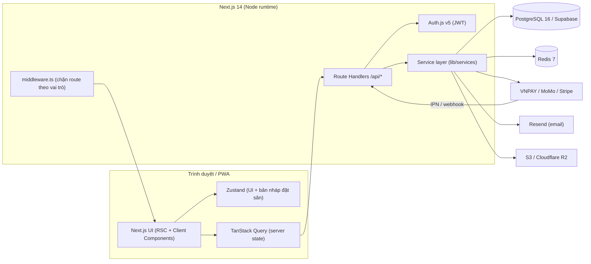

**Nguyên tắc phân lớp:**
- `Route Handler` chỉ: xác thực → validate Zod → gọi **Service** → trả JSON chuẩn. Không viết nghiệp vụ trong handler.
- `Service` chứa nghiệp vụ, gọi Prisma/Redis/Gateway. Thuần hàm (pricing, time) đặt ở `lib/booking/*` để test dễ.
- Trang SEO (trang chủ, danh sách, chi tiết) là **Server Component** truy vấn trực tiếp qua service; thành phần tương tác (lưới đặt sân, bộ lọc, bản đồ) là **Client Component** dùng React Query.

### 3.4 Cấu trúc thư mục

```
src/
├── app/
│   ├── (storefront)/                  # Khách hàng (public + cần đăng nhập)
│   │   ├── page.tsx                   # Trang chủ
│   │   ├── venues/page.tsx            # Danh sách + lọc (+ chế độ bản đồ)
│   │   ├── venues/[slug]/page.tsx     # Chi tiết cơ sở
│   │   ├── venues/[slug]/book/page.tsx        # Lưới đặt sân
│   │   ├── checkout/[code]/page.tsx           # Thông tin & thanh toán
│   │   ├── payment/result/page.tsx            # Kết quả thanh toán
│   │   ├── bookings/page.tsx · bookings/[code]/page.tsx
│   │   ├── favorites/page.tsx · notifications/page.tsx · account/page.tsx
│   │   └── (auth)/login · register · forgot-password · reset-password
│   ├── (admin)/
│   │   ├── owner/                     # Chủ sân / nhân viên
│   │   │   ├── page.tsx (tổng quan) · calendar · bookings · venue · courts
│   │   │   └── pricing · blocks · vouchers · reports · staff(P2)
│   │   └── admin/                     # Quản trị hệ thống
│   │       └── page.tsx · users · venues · reports
│   ├── api/                           # Route Handlers (§7)
│   ├── globals.css · layout.tsx · manifest.ts · sitemap.ts · robots.ts
├── components/
│   ├── ui/                            # Presentational: Button, Input, Badge, Dialog, Sheet, Tabs, Skeleton, EmptyState…
│   └── features/
│       ├── venue/ (VenueCard, VenueFilters, PriceTable, ReviewList, VenueMap)
│       ├── booking/ (BookingGrid, SlotCell, SelectionBar, CountdownTimer, CheckoutForm, BookingCard)
│       ├── home/ (CourtLinesHero, QuickSearch)
│       └── dashboard/ (OwnerCalendar, BookingDrawer, KpiCard, RevenueChart …)
├── lib/
│   ├── prisma.ts · redis.ts · auth.ts · auth.config.ts · env.ts (Zod validate env)
│   ├── booking/ (time.ts, pricing.ts, availability.ts, hold.ts, rules.ts)   # thuần, có unit test
│   ├── services/ (booking.service.ts, payment.service.ts, venue.service.ts, notification.service.ts, report.service.ts)
│   ├── payments/ (gateway.ts, vnpay.ts, momo.ts, stripe.ts)
│   ├── validators/ (auth.ts, booking.ts, venue.ts …)
│   ├── http.ts (apiOk/apiError, AppError, withAuth, rateLimit)
│   └── config/brand.ts · constants.ts
├── stores/ (useBookingDraftStore.ts, useUiStore.ts)
├── hooks/ (useAvailability.ts, useVenues.ts, useMyBookings.ts …)
└── middleware.ts
prisma/ schema.prisma · seed.ts · migrations/
docker-compose.yml · Dockerfile · .env.example
```

---

## 4. Phân tích hướng chức năng

### 4.1 Sơ đồ phân rã chức năng (BFD)

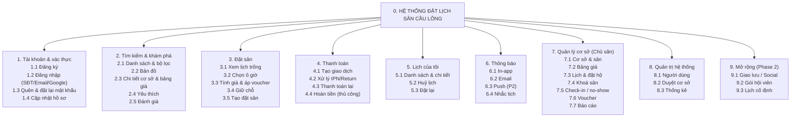

### 4.2 DFD mức 0 (sơ đồ ngữ cảnh)

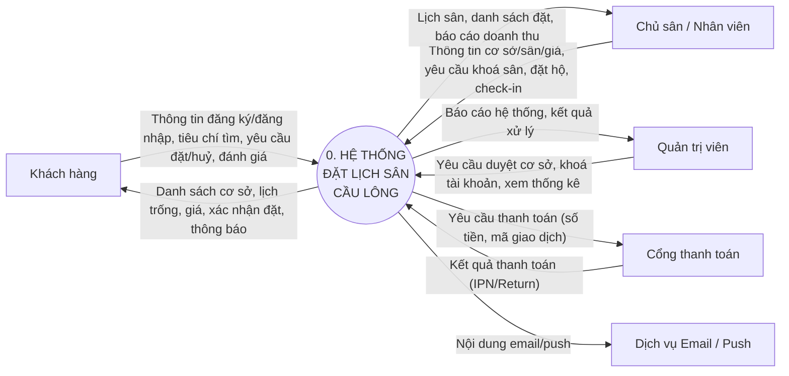

### 4.3 DFD mức 1

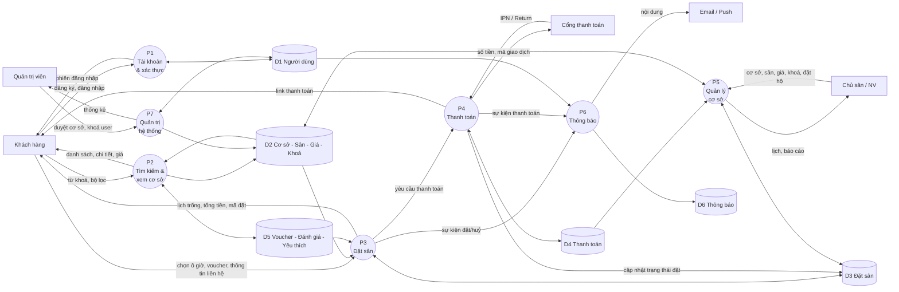

### 4.4 DFD mức 2 — Tiến trình P3 "Đặt sân"

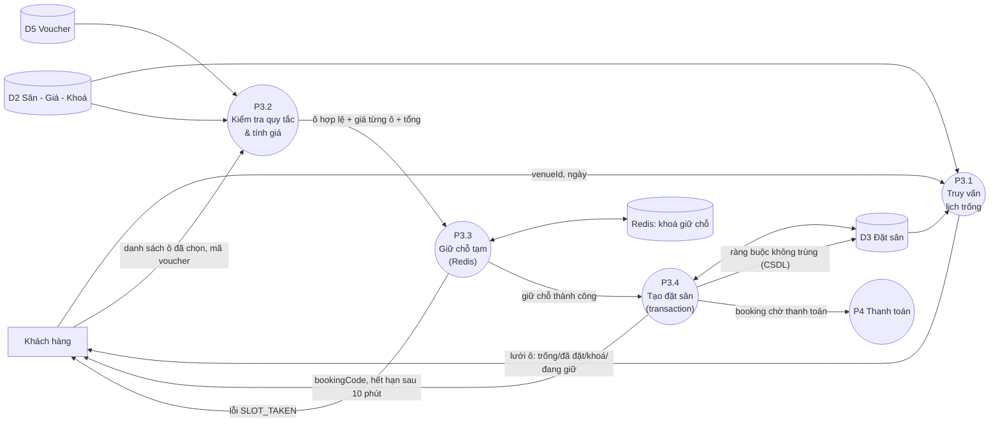

### 4.5 Từ điển dữ liệu (rút gọn)

| Kho dữ liệu | Thành phần chính | Bảng (§6) |
|---|---|---|
| D1 Người dùng | id, tên, SĐT, email, passwordHash, vai trò, trạng thái, điểm | `User`, `Account`, `VerificationToken` |
| D2 Cơ sở–Sân–Giá–Khoá | thông tin cơ sở, giờ mở, sân, quy tắc giá theo thứ & khung giờ, ô bị khoá | `Venue`, `Court`, `PricingRule`, `CourtBlock`, `VenueStaff` |
| D3 Đặt sân | mã đặt, trạng thái, tổng tiền, các ô (sân, ngày, phút bắt đầu/kết thúc, giá) | `Booking`, `BookingItem` |
| D4 Thanh toán | nhà cung cấp, số tiền, `txnRef`, trạng thái, payload gốc | `Payment` |
| D5 Voucher–Đánh giá–Yêu thích | mã, loại giảm, hạn, lượt; điểm sao; cặp user–venue | `Voucher`, `Review`, `Favorite` |
| D6 Thông báo | loại, tiêu đề, nội dung, đã đọc | `Notification`, `PushSubscription` |

| Luồng dữ liệu chính | Cấu trúc |
|---|---|
| **Lưới lịch trống** | `{ date, openMin, closeMin, slotMinutes, courts: [{ id, name, cells: [{ startMin, state, price }] }] }` — `state ∈ AVAILABLE, BOOKED, LOCKED, EVENT, HELD` |
| **Yêu cầu đặt sân** | `{ venueId, items: [{ courtId, date, startMin, endMin }], voucherCode?, contactName, contactPhone, note?, paymentMethod }` |
| **Giao dịch** | `{ bookingId, provider, amount, txnRef, status }` |

---

## 5. Phân tích hướng đối tượng

### 5.1 Sơ đồ Use case

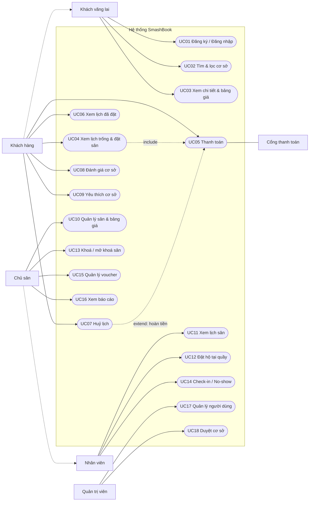
*(Ghi chú: `CU -.-> GU` và `OW -.-> ST` biểu diễn quan hệ kế thừa tác nhân: khách hàng kế thừa mọi quyền của khách vãng lai; chủ sân kế thừa quyền nhân viên.)*

### 5.2 Đặc tả Use case chính

#### UC04 — Xem lịch trống & đặt sân
| Mục | Nội dung |
|---|---|
| Tác nhân | Khách hàng |
| Tiền điều kiện | Cơ sở `ACTIVE`; khách đã đăng nhập (nếu chưa → chuyển đăng nhập rồi quay lại với bản nháp đã chọn) |
| Hậu điều kiện | Tạo `Booking(PENDING_PAYMENT)` + các `BookingItem(HELD)`, giữ chỗ 10 phút |
| **Luồng chính** | 1. Khách mở trang đặt sân của cơ sở, chọn ngày (mặc định hôm nay). 2. Hệ thống trả lưới sân × giờ (làm mới mỗi 15 giây). 3. Khách bấm/kéo chọn các ô liền kề trên một hoặc nhiều sân; thanh tóm tắt cập nhật tạm tính. 4. Khách bấm "Tiếp tục". 5. Hệ thống validate (BR-02, BR-03, BR-15), tính giá (BR-05), giữ chỗ Redis, tạo booking trong transaction. 6. Chuyển sang trang thanh toán `/checkout/[code]` với đồng hồ đếm ngược. |
| Luồng thay thế | **A1** Ô vừa bị người khác đặt/giữ → 409 `SLOT_TAKEN`, giữ lại các ô còn lại, đánh dấu ô xung đột, cho chọn lại. **A2** Dải < tối thiểu hoặc > tối đa → báo lỗi tại dải đó. **A3** Chưa đăng nhập → lưu bản nháp (Zustand persist) → đăng nhập → quay lại. **A4** Redis lỗi → bỏ qua bước giữ chỗ Redis, dựa vào ràng buộc CSDL. |
| Quy tắc | BR-01…BR-05, BR-08, BR-15 |

#### UC05 — Thanh toán
| Mục | Nội dung |
|---|---|
| Tác nhân | Khách hàng; Cổng thanh toán |
| Tiền điều kiện | Booking `PENDING_PAYMENT` chưa hết hạn |
| Hậu điều kiện | Thành công: `Payment=PAID`, `Booking=CONFIRMED`, các ô `CONFIRMED`; thất bại/hết hạn: giải phóng ô |
| **Luồng chính** | 1. Khách nhập thông tin liên hệ, (tuỳ chọn) mã voucher, chọn phương thức. 2. Hệ thống tạo `Payment(PENDING)` với `txnRef` duy nhất và URL thanh toán (hạn = `expiresAt` của booking). 3. Khách thanh toán trên cổng. 4. Cổng gọi **IPN** → hệ thống xác thực chữ ký, đối chiếu số tiền, xử lý idempotent → xác nhận booking. 5. Trình duyệt về `/payment/result` hiển thị kết quả (dựa trên trạng thái trong DB, **không** dựa vào tham số Return). 6. Gửi thông báo + email xác nhận. |
| Luồng thay thế | **A1** Chọn "Trả tại sân" (nếu `paymentMode=AT_VENUE`) → xác nhận ngay, `paymentStatus=UNPAID`. **A2** Giao dịch thất bại → cho "Thanh toán lại" nếu còn hạn. **A3** Thanh toán đến muộn → BR-13. **A4** Chữ ký sai/số tiền lệch → từ chối, ghi log. |

#### UC07 — Huỷ lịch
| Mục | Nội dung |
|---|---|
| Tác nhân | Khách hàng (hoặc Chủ sân/NV huỷ hộ) |
| Tiền điều kiện | Booking `PENDING_PAYMENT` hoặc `CONFIRMED`, chưa đến giờ chơi |
| **Luồng chính** | 1. Khách mở chi tiết booking → "Huỷ lịch". 2. Hệ thống hiển thị kết quả chính sách: *được hoàn tiền* hay *không hoàn* (BR-06). 3. Khách xác nhận. 4. Hệ thống đặt `Booking=CANCELLED`, các ô `CANCELLED` (giải phóng), nếu đã trả tiền và đủ điều kiện → `paymentStatus=REFUND_PENDING`; xoá khoá Redis; gửi thông báo cho khách và chủ sân. |
| Luồng thay thế | **A1** Quá hạn huỷ miễn phí → vẫn cho huỷ nhưng cảnh báo không hoàn tiền (chủ sân quyết định ngoại lệ). **A2** Đã `CHECKED_IN/COMPLETED` → không cho huỷ. |

#### UC12 — Đặt hộ tại quầy
| Mục | Nội dung |
|---|---|
| Tác nhân | Nhân viên / Chủ sân |
| **Luồng chính** | 1. Mở **Lịch sân** (cùng thành phần lưới), chọn ô. 2. Nhập tên + SĐT khách (không bắt buộc tài khoản). 3. Chọn trạng thái thanh toán (đã thu tiền mặt / chưa). 4. Hệ thống tạo `Booking(source=COUNTER, status=CONFIRMED)` qua cùng `BookingService` (dùng cùng ràng buộc chống trùng). |
| Quy tắc | BR-01, BR-10; bỏ qua giữ chỗ 10 phút; vẫn kiểm tra giờ mở cửa và khoá sân |

#### UC13 — Khoá / mở khoá sân
| Mục | Nội dung |
|---|---|
| Tác nhân | Chủ sân |
| **Luồng chính** | Chọn sân + ngày + khung giờ + lý do → hệ thống kiểm tra không có booking đang hiệu lực trong khung đó (BR-15) → tạo `CourtBlock` → ô hiển thị **Khoá**. |
| Luồng thay thế | Có booking trùng → liệt kê booking, yêu cầu huỷ trước. |

### 5.3 Biểu đồ lớp — Mô hình miền (Domain)

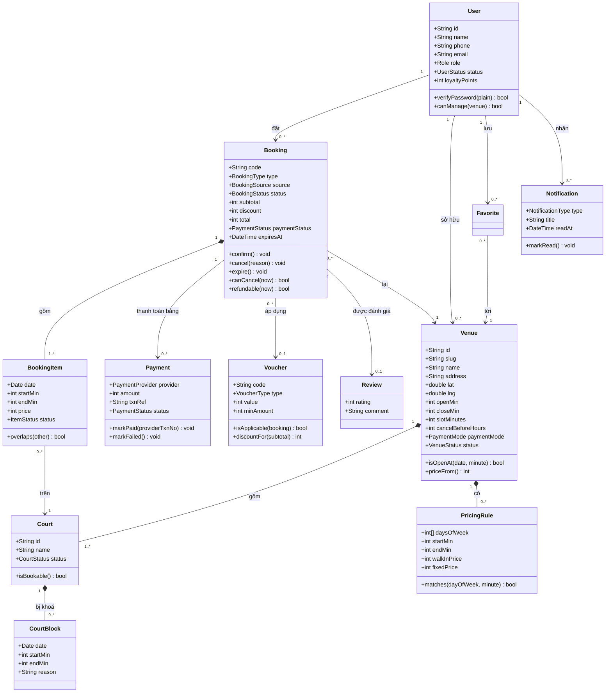

### 5.4 Biểu đồ lớp — Tầng dịch vụ & mẫu thiết kế

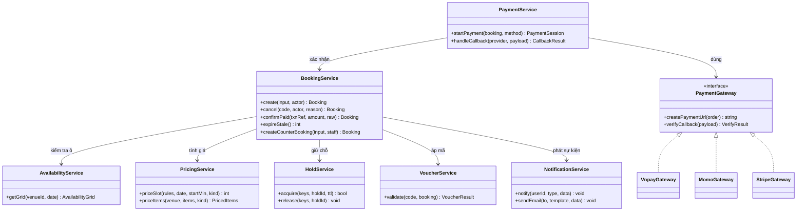

**Mẫu thiết kế áp dụng:**
- **Strategy + Factory** — `PaymentGateway` (VNPAY/MoMo/Stripe) chọn theo `provider` qua `getGateway(provider)`.
- **Repository (qua Prisma)** — service không truy vấn rải rác; mỗi aggregate (Venue, Booking) có hàm truy vấn tập trung.
- **State** — vòng đời `Booking` kiểm soát bằng bảng chuyển trạng thái hợp lệ (§5.7), một hàm `assertTransition(from, to)`.
- **Domain event (đơn giản)** — sau transaction thành công, `BookingService` gọi `NotificationService.notify(...)` (không gọi bên trong transaction).

### 5.5 Biểu đồ tuần tự

**(a) Đặt sân và thanh toán VNPAY**

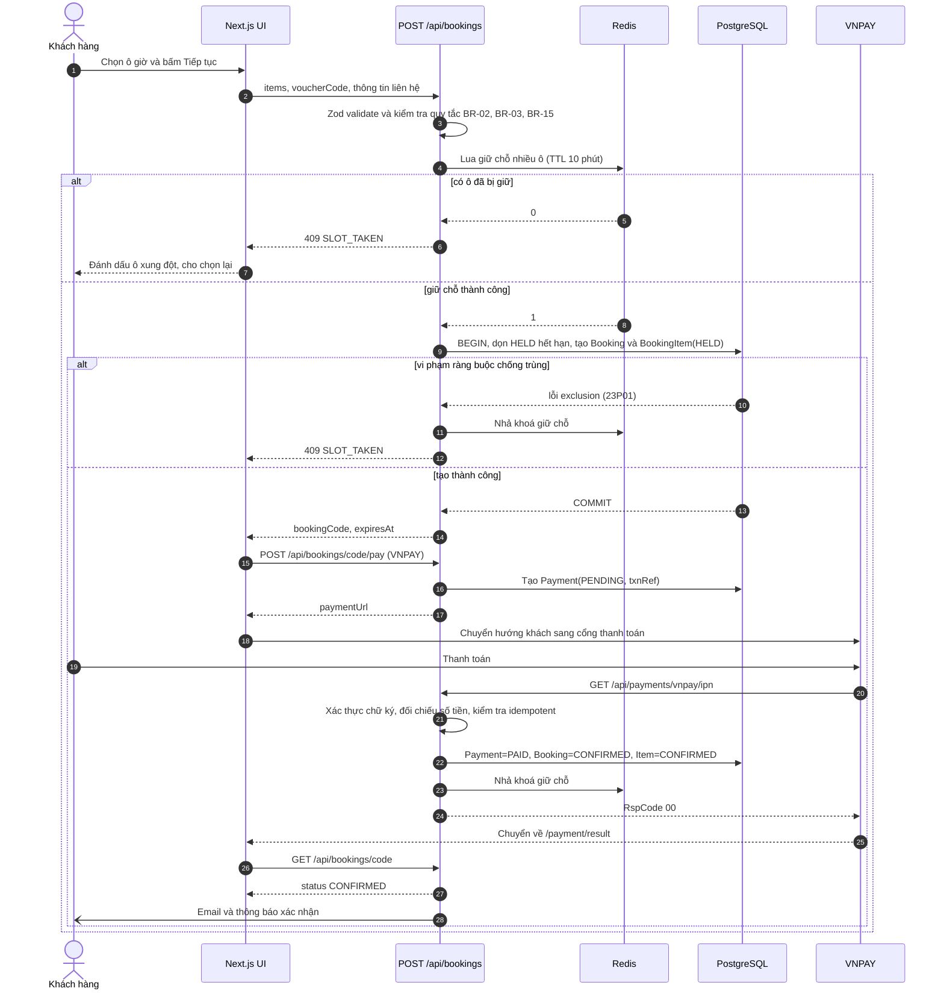

**(b) Huỷ lịch**

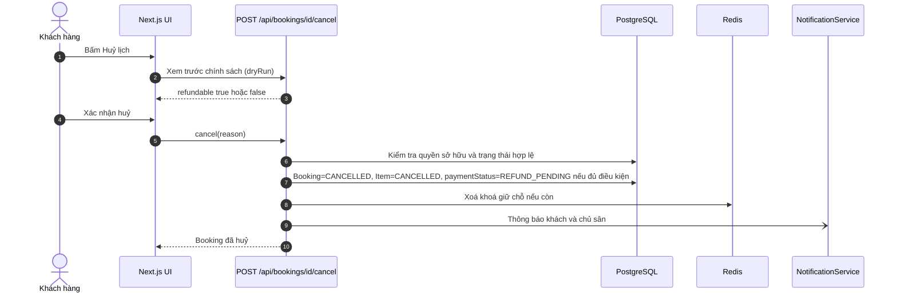

### 5.6 Biểu đồ hoạt động — Quy trình đặt sân

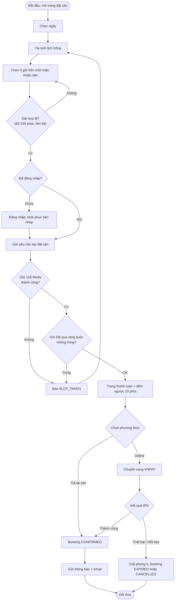

### 5.7 Biểu đồ trạng thái — Booking

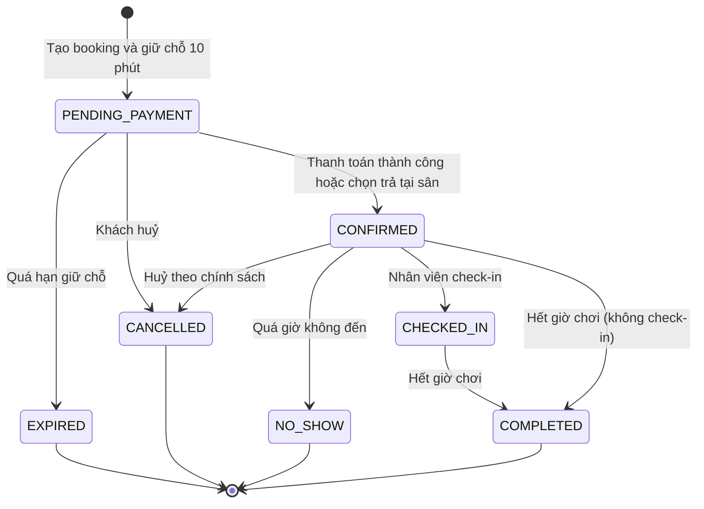

Bảng chuyển hợp lệ (dùng trong `assertTransition`):

| Từ → Đến | Điều kiện |
|---|---|
| PENDING_PAYMENT → CONFIRMED | IPN thành công hợp lệ **hoặc** chọn AT_VENUE |
| PENDING_PAYMENT → EXPIRED | `now > expiresAt` |
| PENDING_PAYMENT / CONFIRMED → CANCELLED | Chủ booking, owner/staff, hoặc admin; chưa check-in |
| CONFIRMED → CHECKED_IN | Owner/staff; trong ngày chơi |
| CONFIRMED → NO_SHOW | Owner/staff; sau giờ bắt đầu |
| CONFIRMED / CHECKED_IN → COMPLETED | Sau giờ kết thúc cuối cùng |

Trạng thái `Payment`: `PENDING → PAID | FAILED`; `PAID → REFUND_PENDING → REFUNDED`.

---

## 6. Thiết kế dữ liệu

### 6.1 ERD

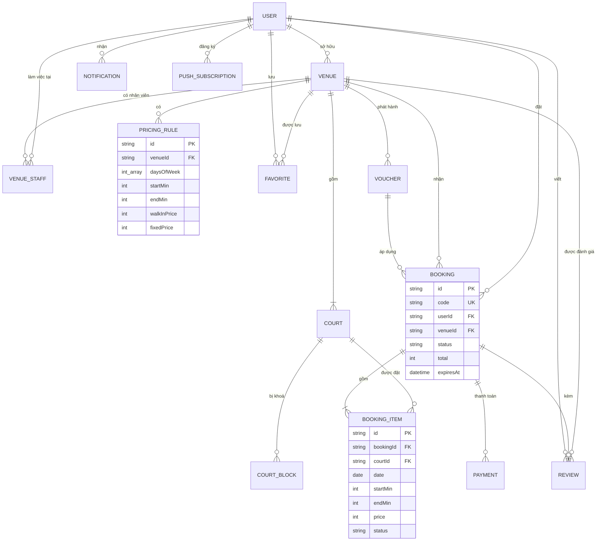

### 6.2 Prisma schema (MVP) — `prisma/schema.prisma`

```prisma
generator client {
  provider      = "prisma-client-js"
  binaryTargets = ["native", "linux-musl-openssl-3.0.x"]
}

datasource db {
  provider  = "postgresql"
  url       = env("DATABASE_URL")
  directUrl = env("DIRECT_URL")
}

// ───────────── Enums ─────────────
enum Role {
  CUSTOMER
  STAFF
  OWNER
  ADMIN
}

enum UserStatus {
  ACTIVE
  BLOCKED
}

enum Sport {
  BADMINTON
  PICKLEBALL
  TENNIS
}

enum VenueStatus {
  PENDING
  ACTIVE
  SUSPENDED
}

enum CourtStatus {
  ACTIVE
  MAINTENANCE
  INACTIVE
}

enum PaymentMode {
  ONLINE_FULL
  AT_VENUE
}

enum BookingType {
  SINGLE
  RECURRING
}

enum BookingSource {
  ONLINE
  COUNTER
  PHONE
}

enum BookingStatus {
  PENDING_PAYMENT
  CONFIRMED
  CHECKED_IN
  COMPLETED
  CANCELLED
  EXPIRED
  NO_SHOW
}

enum ItemStatus {
  HELD
  CONFIRMED
  CANCELLED
  EXPIRED
}

enum PaymentProvider {
  VNPAY
  MOMO
  STRIPE
  CASH
  BANK_TRANSFER
}

enum PaymentStatus {
  UNPAID
  PENDING
  PAID
  FAILED
  REFUND_PENDING
  REFUNDED
}

enum VoucherType {
  PERCENT
  FIXED
}

enum NotificationType {
  BOOKING_CONFIRMED
  BOOKING_CANCELLED
  BOOKING_REMINDER
  PAYMENT_FAILED
  PROMOTION
  SYSTEM
}


// ───────────── Auth.js (Prisma adapter) ─────────────
model Account {
  id                String  @id @default(cuid())
  userId            String
  type              String
  provider          String
  providerAccountId String
  refresh_token     String? @db.Text
  access_token      String? @db.Text
  expires_at        Int?
  token_type        String?
  scope             String?
  id_token          String? @db.Text
  session_state     String?
  user              User    @relation(fields: [userId], references: [id], onDelete: Cascade)

  @@unique([provider, providerAccountId])
}

model Session {
  id           String   @id @default(cuid())
  sessionToken String   @unique
  userId       String
  expires      DateTime
  user         User     @relation(fields: [userId], references: [id], onDelete: Cascade)
}

model VerificationToken {   // dùng cho đặt lại mật khẩu: identifier = email, token lưu dạng băm
  identifier String
  token      String   @unique
  expires    DateTime

  @@unique([identifier, token])
}

// ───────────── Người dùng ─────────────
model User {
  id            String     @id @default(cuid())
  name          String
  email         String?    @unique
  emailVerified DateTime?
  phone         String?    @unique          // dạng 0xxxxxxxxx
  passwordHash  String?
  image         String?
  role          Role       @default(CUSTOMER)
  status        UserStatus @default(ACTIVE)
  loyaltyPoints Int        @default(0)
  createdAt     DateTime   @default(now())
  updatedAt     DateTime   @updatedAt

  accounts      Account[]
  sessions      Session[]
  ownedVenues   Venue[]            @relation("VenueOwner")
  staffOf       VenueStaff[]
  bookings      Booking[]
  reviews       Review[]
  favorites     Favorite[]
  notifications Notification[]
  pushSubs      PushSubscription[]
}

// ───────────── Cơ sở / Sân / Giá ─────────────
model Venue {
  id                String      @id @default(cuid())
  slug              String      @unique
  name              String
  sport             Sport       @default(BADMINTON)
  description       String?
  address           String
  ward              String?
  district          String
  province          String      @default("Hà Nội")
  lat               Float
  lng               Float
  phone             String
  logoUrl           String?
  coverUrl          String?
  images            String[]
  amenities         String[]    // PARKING, SHOWER, WIFI, CANTEEN, RACKET_RENTAL, SHUTTLE_SALE, AIRCON, LOCKER
  openMin           Int         @default(300)    // 05:00
  closeMin          Int         @default(1320)   // 22:00
  slotMinutes       Int         @default(30)
  minBookingMin     Int         @default(60)
  maxBookingMin     Int         @default(240)
  advanceDays       Int         @default(30)
  cancelBeforeHours Int         @default(4)
  paymentMode       PaymentMode @default(ONLINE_FULL)
  status            VenueStatus @default(PENDING)
  priceFrom         Int         @default(0)      // denormalized: giá vãng lai thấp nhất / giờ
  ratingAvg         Float       @default(0)
  ratingCount       Int         @default(0)
  ownerId           String
  createdAt         DateTime    @default(now())
  updatedAt         DateTime    @updatedAt

  owner     User          @relation("VenueOwner", fields: [ownerId], references: [id])
  staff     VenueStaff[]
  courts    Court[]
  pricing   PricingRule[]
  bookings  Booking[]
  reviews   Review[]
  favorites Favorite[]
  vouchers  Voucher[]

  @@index([status, district])
  @@index([lat, lng])
}

model VenueStaff {
  userId  String
  venueId String
  user    User  @relation(fields: [userId], references: [id], onDelete: Cascade)
  venue   Venue @relation(fields: [venueId], references: [id], onDelete: Cascade)

  @@id([userId, venueId])
}

model Court {
  id        String      @id @default(cuid())
  venueId   String
  name      String                      // "Sân 1"
  sortOrder Int         @default(0)
  surface   String?
  status    CourtStatus @default(ACTIVE)

  venue  Venue         @relation(fields: [venueId], references: [id], onDelete: Cascade)
  items  BookingItem[]
  blocks CourtBlock[]

  @@unique([venueId, name])
  @@index([venueId, sortOrder])
}

model PricingRule {
  id          String  @id @default(cuid())
  venueId     String
  label       String?
  daysOfWeek  Int[]                      // 1=Thứ 2 ... 7=Chủ nhật
  startMin    Int
  endMin      Int
  walkInPrice Int                        // VND / giờ — Vãng lai
  fixedPrice  Int                        // VND / giờ — Cố định
  venue       Venue   @relation(fields: [venueId], references: [id], onDelete: Cascade)

  @@index([venueId])
}

model CourtBlock {
  id          String   @id @default(cuid())
  courtId     String
  date        DateTime @db.Date
  startMin    Int
  endMin      Int
  reason      String?
  createdById String
  createdAt   DateTime @default(now())
  court       Court    @relation(fields: [courtId], references: [id], onDelete: Cascade)

  @@index([courtId, date])
}

// ───────────── Đặt sân ─────────────
model Booking {
  id            String        @id @default(cuid())
  code          String        @unique          // ví dụ: SB-241002-7K2F
  userId        String?                        // null = khách đặt hộ tại quầy
  venueId       String
  type          BookingType   @default(SINGLE)
  source        BookingSource @default(ONLINE)
  status        BookingStatus @default(PENDING_PAYMENT)
  customerName  String
  customerPhone String
  note          String?
  subtotal      Int
  discount      Int           @default(0)
  total         Int
  voucherId     String?
  paymentStatus PaymentStatus @default(UNPAID)
  expiresAt     DateTime?
  cancelledAt   DateTime?
  cancelReason  String?
  recurringId   String?                        // Phase 2
  createdAt     DateTime      @default(now())
  updatedAt     DateTime      @updatedAt

  user     User?         @relation(fields: [userId], references: [id])
  venue    Venue         @relation(fields: [venueId], references: [id])
  voucher  Voucher?      @relation(fields: [voucherId], references: [id])
  items    BookingItem[]
  payments Payment[]
  review   Review?

  @@index([userId, createdAt])
  @@index([venueId, status])
  @@index([status, expiresAt])
}

model BookingItem {
  id        String     @id @default(cuid())
  bookingId String
  courtId   String
  date      DateTime   @db.Date
  startMin  Int
  endMin    Int
  price     Int
  status    ItemStatus @default(HELD)

  booking Booking @relation(fields: [bookingId], references: [id], onDelete: Cascade)
  court   Court   @relation(fields: [courtId], references: [id])

  @@index([courtId, date])
  @@index([bookingId])
}

model Payment {
  id            String          @id @default(cuid())
  bookingId     String
  provider      PaymentProvider
  amount        Int
  status        PaymentStatus   @default(PENDING)
  txnRef        String          @unique        // mã giao dịch gửi cổng, duy nhất mỗi lần thử
  providerTxnNo String?
  paidAt        DateTime?
  rawPayload    Json?
  createdAt     DateTime        @default(now())
  booking       Booking         @relation(fields: [bookingId], references: [id], onDelete: Cascade)

  @@index([bookingId])
}

// ───────────── Khuyến mãi, đánh giá, yêu thích, thông báo ─────────────
model Voucher {
  id          String      @id @default(cuid())
  code        String      @unique
  type        VoucherType
  value       Int                              // PERCENT: 1-100, FIXED: VND
  maxDiscount Int?
  minAmount   Int         @default(0)
  venueId     String?                          // null = toàn hệ thống
  validFrom   DateTime
  validTo     DateTime
  usageLimit  Int?
  usedCount   Int         @default(0)
  isActive    Boolean     @default(true)
  venue       Venue?      @relation(fields: [venueId], references: [id])
  bookings    Booking[]
}

model Review {
  id        String   @id @default(cuid())
  bookingId String   @unique
  userId    String
  venueId   String
  rating    Int                                // 1..5
  comment   String?
  createdAt DateTime @default(now())
  booking   Booking  @relation(fields: [bookingId], references: [id], onDelete: Cascade)
  user      User     @relation(fields: [userId], references: [id], onDelete: Cascade)
  venue     Venue    @relation(fields: [venueId], references: [id], onDelete: Cascade)

  @@index([venueId, createdAt])
}

model Favorite {
  userId    String
  venueId   String
  createdAt DateTime @default(now())
  user      User     @relation(fields: [userId], references: [id], onDelete: Cascade)
  venue     Venue    @relation(fields: [venueId], references: [id], onDelete: Cascade)

  @@id([userId, venueId])
}

model Notification {
  id        String           @id @default(cuid())
  userId    String
  type      NotificationType
  title     String
  body      String
  data      Json?
  readAt    DateTime?
  createdAt DateTime         @default(now())
  user      User             @relation(fields: [userId], references: [id], onDelete: Cascade)

  @@index([userId, readAt, createdAt])
}

model PushSubscription {
  id       String @id @default(cuid())
  userId   String
  endpoint String @unique
  p256dh   String
  auth     String
  user     User   @relation(fields: [userId], references: [id], onDelete: Cascade)
}
```

### 6.3 Ràng buộc chống trùng lịch (SQL thủ công — **bắt buộc**)

Chạy `npx prisma migrate dev --create-only --name init`, mở file SQL vừa sinh và **thêm vào cuối**:

```sql
-- Cho phép dùng toán tử "=" kết hợp "&&" trong EXCLUDE
CREATE EXTENSION IF NOT EXISTS btree_gist;

ALTER TABLE "BookingItem"
  ADD CONSTRAINT "booking_item_time_valid"
  CHECK ("startMin" >= 0 AND "endMin" <= 1440 AND "endMin" > "startMin");

-- BR-01: cùng sân + cùng ngày không được có hai khoảng phút giao nhau khi đang hiệu lực
ALTER TABLE "BookingItem"
  ADD CONSTRAINT "booking_item_no_overlap"
  EXCLUDE USING gist (
    "courtId" WITH =,
    "date"    WITH =,
    int4range("startMin", "endMin") WITH &&
  ) WHERE ("status" IN ('HELD', 'CONFIRMED'));
```
Sau đó `npx prisma migrate dev`. Khi vi phạm, Postgres trả mã `23P01`; Prisma ném lỗi chứa tên ràng buộc → service bắt và đổi thành `AppError('SLOT_TAKEN', 409)` (kiểm tra `error.message.includes('booking_item_no_overlap')`).

> Khoảng `int4range(start, end)` là nửa mở `[start, end)` nên 17:00–18:00 và 18:00–19:00 **không** giao nhau — đúng nghiệp vụ.

### 6.4 Mô hình Phase 2 (chưa tạo ở MVP)

```prisma
model SocialEvent {              // Giao lưu / xé vé
  id         String   @id @default(cuid())
  venueId    String
  title      String
  date       DateTime @db.Date
  startMin   Int
  endMin     Int
  levelMin   Float?
  levelMax   Float?
  price      Int
  capacity   Int
  bookingId  String?             // giữ sân bằng một Booking nội bộ do chủ sân tạo
  participants EventParticipant[]
}
model EventParticipant { eventId String  userId String  paidAt DateTime?  @@id([eventId, userId]) }
model MembershipPlan  { id String @id @default(cuid()) venueId String name String price Int durationDays Int hoursIncluded Int? }
model UserMembership  { id String @id @default(cuid()) userId String planId String startsAt DateTime endsAt DateTime hoursLeft Int? }
```
Hạng thành viên (Đồng/Bạc/Vàng) **tính từ `loyaltyPoints`** theo ngưỡng cấu hình, không lưu cột riêng.

### 6.5 Chỉ mục & hiệu năng
- Truy vấn lịch trống dùng `@@index([courtId, date])` trên `BookingItem` và `[courtId, date]` trên `CourtBlock`.
- Danh sách cơ sở: `@@index([status, district])` + bounding box theo `[lat, lng]`; sắp xếp khoảng cách bằng Haversine sau khi lọc.
- `Venue.priceFrom` và `ratingAvg/ratingCount` được cập nhật khi đổi bảng giá / có đánh giá mới.

### 6.6 Thiết kế khoá Redis

| Key | Giá trị | TTL | Dùng cho |
|---|---|---|---|
| `hold:{courtId}:{yyyy-mm-dd}:{startMin}` | `holdId` (id của booking đang giữ) | 600 s | Giữ chỗ từng ô 30' (§8.3) |
| `avail:{venueId}:{yyyy-mm-dd}` | JSON lưới lịch trống | 10 s | Cache; **xoá** khi booking đổi trạng thái |
| `venue:{slug}` | JSON chi tiết cơ sở | 60 s | Cache trang chi tiết |
| `rl:{route}:{ip hoặc userId}` | bộ đếm | theo cửa sổ | Rate limit (§10.1) |

---

## 7. Thiết kế API & tích hợp

### 7.1 Quy ước
- Phản hồi thống nhất:
  - Thành công: `{ "ok": true, "data": ... }`
  - Lỗi: `{ "ok": false, "error": { "code": "SLOT_TAKEN", "message": "Có ô vừa được người khác đặt", "fields"?: {...}, "details"?: ... } }`
- Mã lỗi nghiệp vụ: `VALIDATION_ERROR (400)`, `UNAUTHENTICATED (401)`, `FORBIDDEN (403)`, `NOT_FOUND (404)`, `SLOT_TAKEN (409)`, `HOLD_EXPIRED (409)`, `OUTSIDE_OPEN_HOURS (422)`, `PAST_SLOT (422)`, `COURT_LOCKED (422)`, `INVALID_RANGE (422)`, `VOUCHER_INVALID (422)`, `RATE_LIMITED (429)`, `PAYMENT_SIGNATURE_INVALID (400)`.
- Ngày truyền dạng chuỗi `YYYY-MM-DD`; giờ truyền dạng **phút từ 00:00** (số nguyên).
- Handler dùng helper `withAuth({ roles })` và `rateLimit(...)`. Dữ liệu vào luôn qua Zod.

### 7.2 Danh sách endpoint

**Xác thực & hồ sơ**

| Method | Path | Mô tả | Quyền |
|---|---|---|---|
| POST | `/api/auth/register` | Đăng ký (SĐT, email?, tên, mật khẩu) | Public |
| * | `/api/auth/[...nextauth]` | Handlers Auth.js | Public |
| POST | `/api/auth/forgot-password` | Gửi email đặt lại | Public |
| POST | `/api/auth/reset-password` | Đặt lại bằng token | Public |
| GET / PATCH | `/api/me` | Xem/sửa hồ sơ (gồm thêm email) | User |
| POST | `/api/me/avatar` | Presigned URL upload | User |

**Cơ sở & lịch**

| Method | Path | Mô tả | Quyền |
|---|---|---|---|
| GET | `/api/venues` | Tìm kiếm: `q, district, lat, lng, radiusKm, amenities, minPrice, maxPrice, date, fromMin, toMin, sort, page, pageSize` | Public |
| GET | `/api/venues/map` | Ghim theo `bbox` (rút gọn) | Public |
| GET | `/api/venues/[slug]` | Chi tiết cơ sở | Public |
| GET | `/api/venues/[id]/availability?date=` | **Lưới lịch trống** (§8.2) | Public |
| GET | `/api/venues/[id]/pricing` | Bảng giá | Public |
| GET | `/api/venues/[id]/reviews` | Đánh giá (phân trang) | Public |
| POST | `/api/venues/[id]/favorite` | Bật/tắt yêu thích | User |

**Đặt sân & thanh toán**

| Method | Path | Mô tả | Quyền |
|---|---|---|---|
| POST | `/api/bookings` | Tạo booking + giữ chỗ (§8.4) | Customer |
| GET | `/api/bookings` | Lịch của tôi (`tab=upcoming/past/cancelled`) | Customer |
| GET | `/api/bookings/[code]` | Chi tiết | Chủ booking / Owner / Staff / Admin |
| POST | `/api/bookings/[code]/cancel` | Huỷ (`dryRun` để xem chính sách) | Chủ booking / Owner / Staff |
| POST | `/api/bookings/[code]/pay` | Tạo link thanh toán (`provider`) hoặc chọn trả tại sân | Chủ booking |
| POST | `/api/vouchers/validate` | Kiểm tra voucher cho giỏ hiện tại | Customer |
| GET | `/api/payments/vnpay/return` | Return URL (chỉ redirect về `/payment/result`) | Public |
| GET | `/api/payments/vnpay/ipn` | **IPN** (nguồn xác nhận duy nhất) | Public + ký |
| POST | `/api/payments/momo/ipn` · `/api/payments/stripe/webhook` | Phase 2 | Public + ký |
| POST | `/api/reviews` | Tạo đánh giá (BR-09) | Customer |
| GET / PATCH | `/api/notifications` · `/api/notifications/[id]/read` | Thông báo | User |
| POST | `/api/push/subscribe` | Đăng ký push (P2) | User |

**Chủ sân / Nhân viên** (`/api/owner/...`, kiểm tra thuộc `venueId`, BR-10)

| Method | Path | Mô tả |
|---|---|---|
| GET/PUT | `/api/owner/venues/[id]` | Xem/sửa cơ sở (kể cả chính sách huỷ, `paymentMode`) |
| POST | `/api/owner/venues` | Tạo cơ sở (→ `PENDING`) |
| CRUD | `/api/owner/venues/[id]/courts` | Sân |
| CRUD | `/api/owner/venues/[id]/pricing-rules` | Bảng giá (kiểm tra không chồng khung giờ cùng thứ) |
| CRUD | `/api/owner/venues/[id]/blocks` | Khoá sân (BR-15) |
| GET | `/api/owner/venues/[id]/calendar?date=` | Lưới có thông tin booking trên từng ô |
| GET | `/api/owner/venues/[id]/bookings` | Danh sách + lọc + xuất CSV |
| POST | `/api/owner/venues/[id]/bookings` | **Đặt hộ** tại quầy (UC12) |
| PATCH | `/api/owner/bookings/[code]` | `markPaid`, `checkIn`, `noShow`, `cancel` |
| CRUD | `/api/owner/venues/[id]/vouchers` | Voucher |
| GET | `/api/owner/venues/[id]/reports?from&to` | Doanh thu, lấp đầy, top khách |
| POST | `/api/owner/uploads/presign` | Upload ảnh |

**Admin** (`/api/admin/...`): `users` (list, khoá/mở, đổi vai trò) · `venues` (duyệt/tạm ngưng) · `reports`.

**Cron** (bảo vệ bằng header `Authorization: Bearer ${CRON_SECRET}`): `GET /api/cron/maintenance` — dọn booking hết hạn, chuyển `COMPLETED`, tạo nhắc lịch. Tính đúng đắn **không phụ thuộc cron** (xử lý lười khi truy vấn/đặt sân, §8.5); cron chỉ để dọn dữ liệu và gửi nhắc (chạy mỗi 5–15 phút bằng scheduler ngoài).

### 7.3 Schema Zod mẫu — tạo booking (`lib/validators/booking.ts`)

```ts
import { z } from 'zod'

export const phoneVN = z
  .string()
  .regex(/^(0|\+84)(3|5|7|8|9)\d{8}$/, 'Số điện thoại không hợp lệ')
  .transform((v) => (v.startsWith('+84') ? '0' + v.slice(3) : v))

export const bookingItemInput = z.object({
  courtId: z.string().min(1),
  date: z.string().regex(/^\d{4}-\d{2}-\d{2}$/),
  startMin: z.number().int().min(0).max(1439),
  endMin: z.number().int().min(1).max(1440),
}).refine((i) => i.endMin > i.startMin, { message: 'Giờ kết thúc phải sau giờ bắt đầu' })

export const createBookingInput = z.object({
  venueId: z.string().min(1),
  items: z.array(bookingItemInput).min(1).max(8),
  voucherCode: z.string().trim().toUpperCase().optional(),
  contactName: z.string().trim().min(2).max(80),
  contactPhone: phoneVN,
  note: z.string().max(300).optional(),
})
export type CreateBookingInput = z.infer<typeof createBookingInput>
```

### 7.4 Tích hợp thanh toán VNPAY

Giao diện chung:
```ts
// lib/payments/gateway.ts
export interface PaymentGateway {
  createPaymentUrl(o: { txnRef: string; amount: number; orderInfo: string; ipAddr: string; expireAt: Date; returnUrl: string }): string
  verifyCallback(query: Record<string, string>): { valid: boolean; txnRef: string; amount: number; success: boolean; providerTxnNo?: string }
}
```
Điểm chính khi cài `VnpayGateway` (đối chiếu **tài liệu sandbox VNPAY hiện hành** khi code, không phụ thuộc vào trí nhớ):
- Tham số gửi sang cổng được **sắp xếp theo tên**, ký **HMAC-SHA512** bằng `VNPAY_HASH_SECRET`; số tiền nhân 100 theo quy ước của VNPAY; thời gian tạo/hết hạn theo giờ Việt Nam (GMT+7); `vnp_ExpireDate` = `booking.expiresAt`.
- `txnRef` là chuỗi duy nhất mỗi lần thử (ví dụ `${bookingCode}-${attempt}`), lưu vào `Payment.txnRef`.
- **IPN** (`/api/payments/vnpay/ipn`): xác thực chữ ký → tìm `Payment` theo `txnRef` → so khớp số tiền → nếu đã `PAID` thì trả mã thành công (idempotent, BR-14) → cập nhật trong **transaction** (`Payment=PAID`, `Booking=CONFIRMED`, `Item=CONFIRMED`) → trả JSON phản hồi theo đặc tả VNPAY (thành công / đơn đã xác nhận / sai chữ ký / sai số tiền / không tìm thấy đơn).
- **Return URL** chỉ redirect người dùng về `/payment/result?code=...` và hiển thị trạng thái **đọc từ DB** (có thể chờ vài giây rồi poll). Không xác nhận booking ở Return.
- Env bổ sung: `VNPAY_URL`, `VNPAY_RETURN_URL`, `NEXT_PUBLIC_APP_URL`.

MoMo (`MomoGateway`, HMAC-SHA256) và Stripe (`StripeGateway` + webhook) cài theo cùng interface ở Phase 2.

### 7.5 Thiết kế xác thực & phân quyền

- **Providers:** `Credentials` (định danh = SĐT hoặc email; `authorize` tra `User` theo `phone` hoặc `email`, so sánh bcrypt, từ chối `status=BLOCKED`), `Google`.
- **Session:** JWT. Callback `jwt` nhúng `id`, `role`, `venueIds` (với OWNER/STAFF) vào token; callback `session` đưa ra client. Mở rộng kiểu `Session`/`JWT` trong `types/next-auth.d.ts`.
- **Middleware** (`matcher` loại trừ `_next`, ảnh, favicon):

| Đường dẫn | Điều kiện |
|---|---|
| `/bookings*`, `/favorites`, `/notifications`, `/account`, `/checkout/*` | Đã đăng nhập |
| `/owner/*` | Role `OWNER` hoặc `STAFF` |
| `/admin/*` | Role `ADMIN` |
| `/login`, `/register` | Đã đăng nhập → chuyển về `/` |

- Middleware chỉ là lớp chặn nhanh; **mọi API vẫn kiểm tra lại quyền** (và quyền theo `venueId`) ở server.

---

## 8. Thuật toán lõi

> Đặt trong `lib/booking/*` (hàm thuần) và `lib/services/*`. Các đoạn dưới đây là **đặc tả hành vi + mã tham chiếu**; Agent được phép tinh chỉnh cú pháp nhưng **không đổi hành vi**.

### 8.1 Thời gian (`time.ts`)
Mọi "ngày lịch" được biểu diễn là `Date` ở **00:00 UTC** của ngày đó (khớp `@db.Date`), mọi giờ là **phút từ 00:00 giờ Việt Nam**.

```ts
export const VN_OFFSET_MS = 7 * 3600_000
export const parseDate = (s: string) => new Date(`${s}T00:00:00.000Z`)      // 'YYYY-MM-DD' → Date
export const fmtDate = (d: Date) => d.toISOString().slice(0, 10)
export const isoDow = (d: Date) => (d.getUTCDay() === 0 ? 7 : d.getUTCDay()) // 1=Thứ 2 … 7=CN

export function nowVN() {                                                    // "bây giờ" theo giờ Việt Nam
  const t = new Date(Date.now() + VN_OFFSET_MS)
  return { date: new Date(Date.UTC(t.getUTCFullYear(), t.getUTCMonth(), t.getUTCDate())),
           minutes: t.getUTCHours() * 60 + t.getUTCMinutes() }
}
export const ceilToSlot = (m: number, slot: number) => Math.ceil(m / slot) * slot
export const fmtMin = (m: number) => `${String(Math.floor(m / 60)).padStart(2, '0')}:${String(m % 60).padStart(2, '0')}`
```

### 8.2 Lịch trống (`availability.ts`)
Đầu vào: `venue`, `courts`, `date`, các `BookingItem` còn hiệu lực trong ngày, `CourtBlock`, `PricingRule`.
Với mỗi sân và mỗi ô `startMin` từ `openMin` đến `closeMin - slotMinutes` bước `slotMinutes`, xác định `state` theo **thứ tự ưu tiên**:

1. `LOCKED` nếu: sân không `ACTIVE`; hoặc có `CourtBlock` giao ô; hoặc **ô đã qua** (BR-03: ngày < hôm nay, hoặc ngày = hôm nay và `startMin < ceilToSlot(nowMinutes)`).
2. `BOOKED` nếu có `BookingItem(CONFIRMED)` giao ô.
3. `EVENT` nếu thuộc sự kiện Social (Phase 2).
4. `HELD` nếu có `BookingItem(HELD)` mà `booking.expiresAt > now` (người khác đang giữ).
5. Còn lại `AVAILABLE`.

Mỗi ô trả kèm `price` (giá vãng lai của ô). Kết quả được cache Redis 10 giây (`avail:{venueId}:{date}`) và **xoá cache** mỗi khi booking của cơ sở đó đổi trạng thái. Client dùng `refetchInterval: 15_000`.

### 8.3 Tính giá & giữ chỗ

```ts
// pricing.ts
export function priceSlot(rules: PricingRule[], date: Date, startMin: number, slotMinutes: number, kind: 'walkIn' | 'fixed') {
  const dow = isoDow(date)
  const rule = rules.find(r => r.daysOfWeek.includes(dow) && startMin >= r.startMin && startMin < r.endMin)
  if (!rule) throw new AppError('NO_PRICE_RULE', 422, 'Chưa có bảng giá cho khung giờ này')
  const hourly = kind === 'fixed' ? rule.fixedPrice : rule.walkInPrice
  return Math.round((hourly * slotMinutes) / 60)                             // BR-05
}
```
Ràng buộc khi chủ sân lưu bảng giá: các `PricingRule` cùng thứ **không chồng** và **phủ kín** giờ mở cửa; ranh giới khung giờ phải là bội của `slotMinutes`.

```ts
// hold.ts — giữ nhiều ô nguyên tử bằng Lua (all-or-nothing)
const ACQUIRE = `
for i = 1, #KEYS do if redis.call('EXISTS', KEYS[i]) == 1 then return 0 end end
for i = 1, #KEYS do redis.call('SET', KEYS[i], ARGV[1], 'EX', ARGV[2]) end
return 1`
export const holdKey = (courtId: string, date: string, startMin: number) => `hold:${courtId}:${date}:${startMin}`
// slotKeys(items, slotMinutes): trải mỗi dải [startMin, endMin) thành các key theo bước slotMinutes
// release(keys, holdId): chỉ xoá key có giá trị === holdId (Lua GET/DEL) để không xoá nhầm khoá của người khác
```
Redis chỉ là **bộ lọc nhanh**; nguồn sự thật chống trùng là ràng buộc CSDL (§6.3). Nếu Redis lỗi → bỏ qua giữ chỗ và đi tiếp (NFR-04).

### 8.4 Tạo booking (`BookingService.create`)

```
1. Lấy venue (cache) + courts + pricingRules. Từ chối nếu venue.status != ACTIVE.
2. validateItems(venue, items, now):                       // thuần, có unit test
   - mỗi dải: bội của slotMinutes; nằm trong [openMin, closeMin]; độ dài trong [minBookingMin, maxBookingMin]
   - ngày trong [hôm nay, hôm nay + advanceDays]; không ở quá khứ (BR-03)
   - sân thuộc venue và ACTIVE; không có dải nào của cùng một sân chồng nhau trong request
3. keys = slotKeys(items); holdId = booking id mới (cuid)
4. ok = HoldService.acquire(keys, holdId, 600); nếu !ok → throw SLOT_TAKEN
5. try prisma.$transaction(async tx => {
     a. Dọn HELD hết hạn trên các (courtId, date) liên quan (§8.5)
     b. Kiểm tra CourtBlock giao dải → COURT_LOCKED
     c. Tính giá từng ô → subtotal                           // KHÔNG dùng giá từ client
     d. Nếu có voucherCode → VoucherService.validate → discount; tăng usedCount (trong tx)
     e. Tạo Booking(PENDING_PAYMENT, expiresAt = now + 10 phút, code = genCode())
        + BookingItem(HELD) — mỗi dải một item hoặc mỗi ô một item (xem ghi chú)
   })
   catch (e): release(keys, holdId); nếu e chứa 'booking_item_no_overlap' → throw SLOT_TAKEN; ngược lại ném tiếp
6. Sau commit: xoá cache avail; trả { code, total, expiresAt }
```
**Ghi chú:** lưu **mỗi dải liên tục = một `BookingItem`** (`startMin..endMin`), giá của item = tổng giá các ô trong dải. Ràng buộc `EXCLUDE` hoạt động trên khoảng phút nên vẫn chính xác.
**Mã booking:** `SB-` + `yymmdd` + 4 ký tự base32 ngẫu nhiên (loại ký tự dễ nhầm), thử lại nếu trùng `unique`.

**Đặt hộ tại quầy** dùng cùng hàm nhưng: bỏ giữ chỗ Redis, `source=COUNTER`, `status=CONFIRMED`, item `CONFIRMED` ngay.

### 8.5 Hết hạn giữ chỗ (xử lý lười + cron)
Đặt sân và truy vấn lịch trống đều phải coi booking `PENDING_PAYMENT` có `expiresAt < now` là đã hết hạn. Vì ràng buộc `EXCLUDE` vẫn tính item `HELD`, nên **trước khi chèn** (bước 5a) phải giải phóng chúng:

```sql
-- 1) đánh dấu booking hết hạn có item thuộc các (courtId, date) đang đặt
UPDATE "Booking" b SET "status" = 'EXPIRED'
WHERE b."status" = 'PENDING_PAYMENT' AND b."expiresAt" < NOW()
  AND EXISTS (SELECT 1 FROM "BookingItem" i
              WHERE i."bookingId" = b."id" AND i."courtId" = ANY($1::text[]) AND i."date" = ANY($2::date[]));
-- 2) giải phóng item của các booking vừa EXPIRED
UPDATE "BookingItem" i SET "status" = 'EXPIRED'
FROM "Booking" b
WHERE i."bookingId" = b."id" AND b."status" = 'EXPIRED' AND i."status" = 'HELD';
```
Cron `/api/cron/maintenance` chạy cùng logic cho **toàn bộ** booking hết hạn, đồng thời: chuyển `CONFIRMED/CHECKED_IN → COMPLETED` khi qua giờ kết thúc (BR-12) và tạo thông báo nhắc lịch (2 giờ trước giờ chơi).

### 8.6 Xác nhận thanh toán — idempotent (`confirmPaid`)
```
transaction:
  payment = SELECT ... FROM Payment WHERE txnRef = ? FOR UPDATE      (qua $queryRaw hoặc update có điều kiện)
  nếu payment.status == PAID → return (idempotent, BR-14)
  nếu amount != payment.amount → throw (ghi log, không xác nhận)
  payment → PAID (paidAt, providerTxnNo, rawPayload)
  booking = Booking của payment
  nếu booking.status == PENDING_PAYMENT:
       booking → CONFIRMED, paymentStatus = PAID; items HELD → CONFIRMED
  ngược lại (EXPIRED/CANCELLED):                                      // BR-13 thanh toán đến muộn
       booking.paymentStatus = REFUND_PENDING; thông báo chủ sân + admin
sau commit: nhả khoá Redis, xoá cache avail, gửi thông báo + email
```

### 8.7 Chính sách huỷ (`rules.ts`)
```ts
// firstStart = thời điểm bắt đầu sớm nhất của các item (ngày + startMin theo giờ VN)
canCancel(booking, now)   = status ∈ {PENDING_PAYMENT, CONFIRMED} && now < firstStart
refundable(booking, now)  = booking.paymentStatus == PAID && (firstStart - now) >= venue.cancelBeforeHours * 3600_000
```

---

## 9. Thiết kế UI/UX

### 9.1 Kế hoạch thiết kế (đã đối chiếu với mặc định phổ biến)

**Đối tượng & nhiệm vụ chính:** người chơi cầu lông phong trào ở đô thị, thường dùng điện thoại, cần *biết ngay khung giờ nào còn trống và giá bao nhiêu*, rồi đặt trong vài chạm.

**Ý tưởng nhận diện lấy từ chính môn thể thao:** *sân cầu lông nhìn từ trên xuống* — nền sàn xanh, vạch kẻ trắng. Đây là **một điểm nhấn duy nhất** (hero + hàng tiêu đề của lưới đặt sân); phần còn lại giữ yên tĩnh, rõ ràng, ưu tiên dữ liệu (giờ, giá, trạng thái).

**Khác biệt có chủ đích so với giao diện tham khảo (đổi màu, bố cục):**
- Tham khảo dùng xanh lá + vàng, bố cục "app trong khung" có thanh tab dưới ở cả desktop. **SmashBook:** xanh sàn (court blue) + cam vợt (coral); desktop dùng **thanh điều hướng trên cùng**, mobile mới dùng **thanh tab dưới**.
- Hero là **ô tìm kiếm khu vực + ngày + giờ** nằm trên nền vạch sân; không dùng banner trượt.
- Thẻ cơ sở: ảnh bên trên, **giá từ** nổi bật, chip "Còn trống tối nay", nút "Đặt sân" dạng câu lệnh (chữ thường, không in hoa toàn bộ).
- Lưới đặt sân có **thanh tóm tắt cố định**, **đường "Bây giờ"**, ký hiệu hoạ tiết ngoài màu; mobile **đảo trục**.

**Đã loại bỏ các mẫu "mặc định" dễ thấy:** không nền kem + serif + đất nung; không nền đen + xanh chuối; không chia mọi thứ thành thẻ giống hệt cùng bo góc cùng bóng đổ (bo góc phân cấp theo vai trò, §9.2); không nhãn IN HOA giãn chữ phía trên mỗi tiêu đề; không đánh số 01/02/03 trừ khi nội dung thật sự là chuỗi bước (chỉ thanh bước thanh toán); không thêm "→" vào mọi nút; không animation trượt-hiện cho từng khối.

### 9.2 Design tokens

**Bảng màu lõi (đặt tên theo đối tượng thật):**

| Tên | Hex | Vai trò |
|---|---|---|
| `court-600` (Sàn xanh) | `#1D3DB8` | Màu thương hiệu, nút chính, ô đã chọn, hàng tiêu đề lưới |
| `court-900` (Mực sàn) | `#0E1D57` | Chữ chính, nền hero đậm |
| `racket-500` (Cam vợt) | `#FF6A3D` | Nút hành động chính (đặt sân, thanh toán). **Chữ trên nền cam dùng `court-900`** (tương phản ≈ 5,5:1); không dùng chữ trắng trên cam |
| `line` (Vạch kẻ) | `#FFFFFF` | Vạch sân trên nền xanh, nền thẻ |
| `mist` (Sương) | `#F3F5FB` | Nền trang (xanh xám rất nhạt, không phải kem) |
| `slate-500` | `#5A6482` | Chữ phụ (tương phản ≥ 5,4:1 trên nền trắng và `mist`) |

Thang `court`: `50 #EDF1FD · 100 #D9E2FA · 200 #B3C4F4 · 300 #859FEB · 400 #5578DE · 500 #2F57CC · 600 #1D3DB8 · 700 #173195 · 800 #122774 · 900 #0E1D57`.
Thang `racket`: `400 #FF8A63 · 500 #FF6A3D · 600 #E9521F`.
Ngữ nghĩa: `success #0F7B5F` · `danger #C42B1C` · `warning #8A5A00`; đường viền `#DCE2F2`.

**Trạng thái ô lịch** (xem thêm §9.3): `AVAILABLE` nền `#FFFFFF`; `SELECTED` nền `court-600` chữ trắng; `BOOKED` nền `#FBD9D5` chữ `#8A1C12`; `LOCKED` nền `#E6E9F2` chữ `slate-500`; `EVENT` nền `#E7DBFF` chữ `#4A1D96`; `HELD` nền `#FFEFB8` chữ `#6B4E00`.

**Chế độ tối** (`next-themes`, class `dark`): nền `#0B1020`, bề mặt `#121A33`, chữ `#E8ECFA`, chữ phụ `#9AA5C7`, viền `#25305A`, nút chính `court-500`, cam vợt giữ nguyên (chữ trên cam vẫn `#0E1D57`). Mọi màu khai báo bằng **CSS variables** để đổi theme không sửa component.

**Chữ:** một họ duy nhất **Be Vietnam Pro** (hỗ trợ đầy đủ tiếng Việt) qua `next/font/google` với `subsets: ['latin', 'vietnamese']`, trọng số 400/500/600/700. Tiêu đề 700, letter-spacing `-0.01em`. Bật `tabular-nums` cho **giờ và giá** để cột thẳng hàng.
Thang cỡ chữ (px / line-height): 12/16 · 14/20 · 16/24 · 18/28 · 22/30 · 28/36 · 36/44 · 48/56. Đoạn văn dài tối đa ~70 ký tự mỗi dòng. Văn bản **sentence case**, không in hoa toàn bộ.

**Hình khối:** bo góc theo vai trò — `container 20px` · `card 12px` · `control (input/button) 10px` · `slot 6px` · `chip full`. Bóng đổ chỉ có 2 mức: `shadow-sm` cho thẻ nổi, `shadow-lg` cho sheet/popover. Khoảng cách theo bước 4 px. Vùng chạm ≥ 44 px.

**Chuyển động:** tối thiểu và phản hồi hành động — chọn/bỏ chọn ô (120 ms), mở sheet/drawer (200 ms), toast. **Không** hiệu ứng trượt-hiện khi cuộn. Tôn trọng `prefers-reduced-motion` (tắt hẳn transition không thiết yếu).

`globals.css` (rút gọn, dạng `R G B` để dùng được `/ <alpha>`):
```css
:root {
  --bg: 243 245 251;  --surface: 255 255 255;  --ink: 14 29 87;  --muted: 90 100 130;  --border: 220 226 242;
  --court: 29 61 184;  --racket: 255 106 61;
}
.dark {
  --bg: 11 16 32;  --surface: 18 26 51;  --ink: 232 236 250;  --muted: 154 165 199;  --border: 37 48 90;
  --court: 47 87 204;  --racket: 255 106 61;
}
body { background: rgb(var(--bg)); color: rgb(var(--ink)); font-feature-settings: "tnum" 1; }
@media (prefers-reduced-motion: reduce) { * { transition: none !important; animation: none !important; } }
```
`tailwind.config.ts`: `darkMode: 'class'`; `extend.colors` gồm `court` (thang trên), `racket`, `mist`, và các token CSS-variable (`bg`, `surface`, `ink`, `muted`, `border` dạng `rgb(var(--x) / <alpha-value>)`); `extend.borderRadius` gồm `container: '20px'`, `card: '12px'`, `control: '10px'`, `slot: '6px'`; `fontFamily.sans: ['var(--font-bvp)', 'system-ui', 'sans-serif']`.

### 9.3 Trạng thái ô lịch — không chỉ dựa vào màu (NFR-06)

| Trạng thái | Nhãn (tiếng Việt) | Màu | Hoạ tiết / ký hiệu bổ sung |
|---|---|---|---|
| AVAILABLE | Trống | trắng, viền mảnh | Không (hover: nền `court-50`) |
| SELECTED | Đã chọn | `court-600` | Dấu tích ✓ ở giữa ô |
| BOOKED | Đã đặt | hồng nhạt | **Gạch chéo** nền (repeating-linear-gradient 45°) |
| LOCKED | Khoá | xám nhạt | **Chấm bi** nền; con trỏ `not-allowed` |
| EVENT | Sự kiện | tím nhạt | Biểu tượng ngôi sao nhỏ |
| HELD | Đang giữ | vàng nhạt | **Biểu tượng đồng hồ**; tooltip "Có người đang giữ chỗ, thử lại sau ít phút" |

Mỗi ô có `aria-label` dạng "Sân 2, 18:00 đến 18:30, Trống, 55.000 ₫". Chú giải (legend) luôn hiển thị phía trên lưới, đủ cả hoạ tiết lẫn màu.

### 9.4 Điều hướng & sơ đồ trang

| Thiết bị | Điều hướng |
|---|---|
| Desktop (≥ 1024px) | Thanh trên cùng cố định: logo · Sân cầu lông · Bản đồ · Ưu đãi(P2) · chuông thông báo · avatar/menu (Lịch của tôi, Yêu thích, Tài khoản, Đăng xuất) |
| Mobile (< 768px) | Thanh tab dưới: **Trang chủ · Bản đồ · Lịch của tôi · Tài khoản** (đặt sân là hành động ngay trên thẻ/trang chi tiết nên không cần nút nổi ở giữa) |

Breakpoints (Tailwind mặc định): `sm 640 · md 768 · lg 1024 · xl 1280`. Nội dung tối đa `max-w-6xl`.

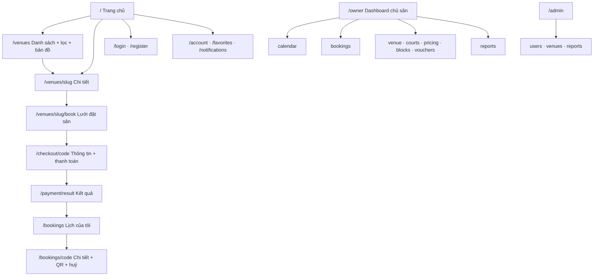

### 9.5 Wireframe các màn hình chính

**Trang chủ (desktop)**
```
─ Thanh trên: [SmashBook]  Sân cầu lông   Bản đồ                    🔔  [Đăng nhập] [Đăng ký]
─ HERO  nền court-700, vạch sân trắng (SVG, độ mờ 20%) nằm lệch phải, cắt mép
│  Tìm sân cầu lông gần bạn, đặt trong vài chạm            (tiêu đề 48/56, căn trái)
│  ┌─────────────────────────────────────────────────────────────┐
│  │ 📍 Khu vực / tên sân │ 📅 Ngày  │ 🕐 Từ giờ │ [ Tìm sân trống ]  │  ← thẻ trắng nổi, nút cam
│  └─────────────────────────────────────────────────────────────┘
│  Chip nhanh:  Gần tôi · Còn trống tối nay · Dưới 80.000 ₫ · Có điều hoà · Có chỗ đậu xe
─ Gần bạn                                              Xem tất cả
│  [Thẻ][Thẻ][Thẻ]   ← lưới 3 cột (≥lg), 2 cột (md), 1 cột (mobile)
─ Đánh giá cao nhất
│  [Thẻ][Thẻ][Thẻ]
─ Chân trang: giới thiệu · điều khoản · chính sách huỷ · liên hệ
```
Thẻ cơ sở (`VenueCard`): ảnh 16:9 (góc trên bo `card`) · nút ♡ góc phải · tên · ⭐ điểm (số đánh giá) · địa chỉ rút gọn · khoảng cách · giờ mở · **"Từ 60.000 ₫/giờ"** · chip "Còn trống tối nay" (nếu có) · nút **Đặt sân** (cam). Cơ sở đóng cửa/hết chỗ: nút xám "Hết lịch hôm nay".

**Chi tiết cơ sở**
```
[Thư viện ảnh: 1 ảnh lớn + 4 ảnh nhỏ]                          ┌ Thẻ đặt sân (sticky, cột phải) ┐
Tên cơ sở  ⭐4,8 (126)    ♡ Lưu   ↗ Chia sẻ                     │ Từ 60.000 ₫ / giờ               │
📍 Địa chỉ · 3,9 km · Mở 05:00–22:00 · Còn trống tối nay        │ Ngày: [02/10/2026 ▾]            │
Tabs: Tổng quan | Bảng giá | Sân | Đánh giá | Giao lưu (P2)      │ [ Xem lịch trống và đặt sân ]   │
─ Tổng quan: mô tả, tiện ích (icon), chính sách huỷ, bản đồ nhỏ  │ Chính sách huỷ: trước 4 giờ ... │
─ Bảng giá: bảng Thứ × Khung giờ × Vãng lai / Cố định           └─────────────────────────────────┘
          (hàng khung giờ hiện tại được tô nổi)                  (mobile: thẻ này thành thanh cố định dưới đáy)
```

**Lưới đặt sân — desktop (`md+`)**
```
← Tên cơ sở                                             Ngày: [‹] 02/10/2026 [›]  📅
Chú giải: [Trống] [Đã chọn ✓] [Đã đặt ▨] [Khoá ·] [Sự kiện ★] [Đang giữ ⏱]     Xem bảng giá
        │ 05:00 05:30 06:00 ... 17:30 18:00 18:30 ... 21:30 22:00     ← tiêu đề giờ dính trên (court-700)
 Sân 1  │ ·····(khoá)·····│ ▨▨▨ │ ○ ○ ○ ✓ ✓ ○ ...                    ← cột tên sân dính trái
 Sân 2  │ ·····(khoá)·····│ ○ ○ ○ ○ ○ ...
 Sân 3  │                ┆ ← đường "Bây giờ" (cam) cắt qua các hàng
 Sân 4  │
        Zoom [−■──+]  (độ rộng ô 40–96 px)
─ Thanh tóm tắt (dính đáy):  Sân 1 · 18:00–19:30 (3 ô)   Sân 2 · 19:00–20:00 (2 ô)     Tạm tính 275.000 ₫   [ Tiếp tục ]
```

**Lưới đặt sân — mobile (`< md`, đảo trục)**
```
Ngày: ‹ 02/10 ›        (dải chọn ngày cuộn ngang 7 ngày tới)
         Sân 1  Sân 2  Sân 3  Sân 4     ← tiêu đề dính trên
 18:00   [ ✓ ]  [ ○ ]  [ ▨ ]  [ ○ ]
 18:30   [ ✓ ]  [ ○ ]  [ ▨ ]  [ ○ ]
 19:00   [ ○ ]  [ ○ ]  [ ○ ]  [ · ]
 ...                                     (cuộn dọc)
─ Thanh tóm tắt dính đáy: 3 ô · 275.000 ₫   [ Tiếp tục ]
```

**Thanh toán (checkout)**
```
Thanh bước:  ① Chọn sân và giờ  ─  ② Thanh toán  ─  ③ Hoàn tất        (chỉ ở đây dùng số vì là chuỗi bước thật)
Cột trái:                                              Cột phải (dính): Tóm tắt
  Thông tin liên hệ: Họ tên · Số điện thoại · Ghi chú    Tên cơ sở, ngày
  Mã ưu đãi:  [________] [Áp dụng]                         Sân 1 · 18:00–19:30   150.000 ₫
  Phương thức: (•) VNPAY — QR / thẻ ATM                    Sân 2 · 19:00–20:00   125.000 ₫
               ( ) Thẻ quốc tế (Phase 2)                    Giảm giá                -20.000 ₫
               ( ) Trả tại sân (nếu cơ sở cho phép)         Tổng                    255.000 ₫
  [ Thanh toán 255.000 ₫ ]  (nút cam)                       ⏱ Giữ chỗ còn 09:41
```

**Lịch của tôi**
```
Tabs: Sắp tới | Đã chơi | Đã huỷ
[Thẻ booking]  SB-241002-7K2F · Đã xác nhận ●           Cơ sở X · Sân 1 · 18:00–19:30 · T6 02/10
               Tổng 150.000 ₫ · Đã thanh toán          [ Xem chi tiết ] [ Huỷ ]   (Đã chơi: [ Đánh giá ] [ Đặt lại ])
Trống: "Chưa có lịch nào. Tìm sân và đặt lịch đầu tiên."  [ Tìm sân ]
```

**Dashboard chủ sân — Lịch sân**
```
Sidebar: Tổng quan · Lịch sân · Đặt sân · Cơ sở & sân · Bảng giá · Khoá sân · Voucher · Báo cáo
Chọn cơ sở ▾   Ngày [‹ 02/10/2026 ›]   [ + Đặt hộ ]   [ Khoá sân ]
Lưới giống khách nhưng ô BOOKED hiển thị tên khách rút gọn + chấm trạng thái thanh toán.
Bấm vào ô đã đặt → Drawer phải: mã, khách (gọi nhanh), giờ, tổng tiền, trạng thái thanh toán
   [ Đã thu tiền ] [ Check-in ] [ Không đến ] [ Huỷ lịch ]
Trang Tổng quan: 4 thẻ KPI (Doanh thu hôm nay · Lượt đặt · Tỷ lệ lấp đầy · Sắp diễn ra) + biểu đồ 7 ngày + bảng "Sắp tới hôm nay".
```

### 9.6 Đặc tả thành phần then chốt

**`BookingGrid`** (`components/features/booking`)
- **Props:** `venue`, `date`, `data: AvailabilityGrid`, `orientation: 'courts-rows' | 'courts-cols'` (chọn theo breakpoint), `value: Selection[]`, `onChange`, `mode: 'customer' | 'owner'`.
- **Hành vi chọn:** bấm ô bắt đầu rồi bấm ô kết thúc (hoặc **kéo**) để chọn một dải liền kề trên *cùng một sân*; bấm lại ô đã chọn để bỏ. Không cho chọn qua ô không `AVAILABLE`. Dải ngắn hơn `minBookingMin` hiển thị cảnh báo tại dải (không chặn thao tác, chặn nút Tiếp tục). Vượt `maxBookingMin` hoặc 8 dải → thông báo.
- **Giá:** tạm tính hiển thị theo `cell.price` từ server; số cuối do server tính lại (BR-05).
- **Bàn phím:** `role="grid"`, mũi tên di chuyển giữa ô, `Space/Enter` chọn, `Esc` bỏ chọn dải đang mở.
- **Trực quan:** hàng/cột tiêu đề **dính**; đường "Bây giờ" khi xem hôm nay; thanh zoom (desktop); tự cuộn tới giờ hiện tại hoặc giờ mở cửa.
- **Dữ liệu:** `useAvailability(venueId, date)` với `refetchInterval: 15_000`, `keepPreviousData`. Khi dữ liệu mới khiến ô đã chọn không còn `AVAILABLE` → bỏ ô đó khỏi lựa chọn và báo "Ô 18:00 vừa có người đặt".
- **Skeleton** khi tải; **empty** khi cơ sở đóng cửa ngày đó.

**Store `useBookingDraftStore` (Zustand + `persist` sessionStorage):** `{ venueId, date, selections: { courtId, startMin, endMin }[], set…, clear }`. Khôi phục sau khi đăng nhập (UC04-A3). Nếu `date` đã qua hoặc `venueId` đổi → tự xoá.

**`CountdownTimer`:** nhận `expiresAt` (ISO), hiển thị `mm:ss`, đồng bộ theo giờ server (tính độ lệch lúc tải), khi về 0 → hiện hộp thoại "Hết thời gian giữ chỗ" + nút "Chọn lại giờ".

**`VenueFilters`:** quận/huyện, khoảng giá (slider), tiện ích (checkbox), ngày + giờ (lọc còn trống), sắp xếp. Trạng thái lọc nằm trên **URL query** (chia sẻ/quay lại được). Mobile: mở dạng bottom sheet.

**`VenueMap`:** Leaflet + OSM; ghim theo `bbox` đang xem; chọn ghim → bottom sheet thẻ cơ sở rút gọn; nút định vị người dùng; nút chuyển Danh sách/Bản đồ. Tải bằng `next/dynamic` (`ssr: false`).

Danh mục `components/ui` tối thiểu: `Button` (primary / accent / ghost / danger), `Input`, `Select`, `Checkbox`, `Badge`, `Chip`, `Dialog`, `Sheet`, `Tabs`, `Popover`, `Skeleton`, `EmptyState`, `Stepper`, `Toast` (sonner), `Avatar`, `Rating`.

### 9.7 Nội dung giao diện (microcopy) & trạng thái

Nguyên tắc: tiếng Việt đơn giản, câu chủ động, nút nói rõ việc sẽ xảy ra, **một hành động giữ một tên xuyên suốt luồng**.

| Tình huống | Nội dung |
|---|---|
| Nút chính trên thẻ | "Đặt sân" |
| Nút ở lưới | "Tiếp tục" · ở checkout: "Thanh toán 255.000 ₫" · trả tại sân: "Xác nhận đặt sân" |
| Thành công đặt | Toast/trang kết quả: "Đã xác nhận lịch đặt SB-241002-7K2F" |
| Ô vừa bị đặt | "Ô 18:00 vừa có người đặt. Hãy chọn khung giờ khác." |
| Hết giữ chỗ | "Hết thời gian giữ chỗ. Chọn lại giờ để tiếp tục." |
| Chưa đăng nhập khi đặt | "Đăng nhập để hoàn tất đặt sân. Giờ bạn đã chọn sẽ được giữ lại." |
| Danh sách rỗng | "Không có sân phù hợp. Thử đổi khu vực hoặc bỏ bớt bộ lọc." |
| Lịch của tôi rỗng | "Chưa có lịch nào. Tìm sân và đặt lịch đầu tiên." |
| Lỗi mạng | "Không tải được dữ liệu. Kiểm tra kết nối rồi thử lại." + nút "Thử lại" |
| Thanh toán lỗi | "Thanh toán chưa thành công. Giờ bạn chọn vẫn được giữ đến 18:42." + "Thanh toán lại" |
| Huỷ không hoàn tiền | "Lịch này bắt đầu sau chưa đầy 4 giờ nên không được hoàn tiền. Bạn vẫn muốn huỷ?" |
| Banner email | "Thêm email để lấy lại mật khẩu khi cần." |

Mọi danh sách có đủ 4 trạng thái: **loading (skeleton) · empty · error (có Thử lại) · data**. Lỗi form hiển thị ngay dưới từng ô, nói rõ cách sửa.

### 9.8 Truy cập, SEO, PWA
- **A11y:** tương phản ≥ 4,5:1 (đã chọn màu theo mục tiêu này), focus ring rõ (2 px `court-400` + khoảng cách 2 px), nhãn cho mọi input, `aria-live="polite"` cho đồng hồ đếm ngược và thông báo lỗi, không truyền đạt thông tin chỉ bằng màu (§9.3).
- **SEO:** `generateMetadata` cho trang chi tiết; JSON-LD `SportsActivityLocation` (tên, địa chỉ, toạ độ, giờ mở, điểm đánh giá); `sitemap.ts` liệt kê cơ sở `ACTIVE`; `robots.ts` chặn `/owner`, `/admin`, `/checkout`, `/api`.
- **PWA (nhẹ):** `manifest.ts` (tên, biểu tượng, `display: standalone`, `theme_color: #1D3DB8`) để cài lên màn hình chính. Service worker chỉ làm ở Phase 2 (push).

---

## 10. Bảo mật, kiểm thử, triển khai

### 10.1 Bảo mật
- Mật khẩu: bcrypt cost 12; không log mật khẩu/token; token đặt lại mật khẩu ngẫu nhiên 32 byte, lưu **băm**, hết hạn 30 phút, dùng một lần.
- **Rate limit** (Redis, cửa sổ cố định): đăng nhập 5/phút theo (IP + định danh); đăng ký 5/giờ/IP; quên mật khẩu 3/giờ; tạo booking 10/phút/người dùng; `vouchers/validate` 20/phút.
- Validate mọi input bằng Zod; escape khi render; không `dangerouslySetInnerHTML` với dữ liệu người dùng.
- Xác thực chữ ký IPN, kiểm tra số tiền, idempotent; không tin tham số Return.
- Kiểm quyền theo `venueId` ở mọi API quản lý (BR-10); không dựa vào ẩn UI.
- Header bảo mật trong `next.config.mjs` (`X-Content-Type-Options`, `Referrer-Policy`, `X-Frame-Options`, CSP cơ bản). Secret chỉ ở biến môi trường; biến `NEXT_PUBLIC_*` không chứa bí mật. Validate env lúc khởi động (`lib/env.ts`).
- Upload ảnh: presigned URL, giới hạn loại (`image/jpeg|png|webp`) và dung lượng (≤ 5 MB).

### 10.2 Kiểm thử
- **Unit (Vitest) — bắt buộc cho `lib/booking/*`:** `priceSlot` (biên 17:00, 19:00; thứ 2…CN; không có rule), `validateItems` (bội slot, quá khứ, quá giờ, min/max, 8 dải, chồng nhau), `canCancel/refundable` (biên đúng 4 giờ), `ceilToSlot` (17:40 → 18:00), `nowVN` quanh nửa đêm.
- **Tích hợp:** chèn hai `BookingItem` giao nhau → bị chặn bởi `booking_item_no_overlap`; `[17:00,18:00)` và `[18:00,19:00)` thì được phép.
- **E2E (Playwright):** luồng đặt sân (chọn ô → checkout → trả tại sân → xuất hiện trong "Lịch của tôi"); **đua đặt**: hai phiên song song cùng một ô → đúng một thành công, một nhận `SLOT_TAKEN`; hết hạn giữ chỗ (rút ngắn TTL trong môi trường test).
- **Checklist QA nghiệp vụ:** IPN gọi lặp (không xử lý đôi) · IPN sai chữ ký · thanh toán đến muộn (BR-13) · khoá sân chồng booking · quyền chéo cơ sở (owner A không sửa được cơ sở B) · khách `BLOCKED` không đăng nhập được.

### 10.3 Triển khai
- **Local:** `docker compose up` (app, postgres 16, redis 7) theo template; seed bằng `npm run db:seed`.
- **Production (gợi ý):** Vercel (hoặc VPS Docker) + Supabase (dùng `DATABASE_URL` pooler 6543 cho runtime, `DIRECT_URL` cho migrate) + Redis được quản lý (Upstash dùng TCP `rediss://` tương thích `ioredis`).
- Scheduler gọi `/api/cron/maintenance` với `CRON_SECRET`.
- CI: `lint` → `tsc --noEmit` → `vitest` → `build` → `prisma migrate deploy`.

---

## 11. Kế hoạch triển khai (Milestones cho Agent)

> Mỗi milestone kết thúc bằng: `npm run lint && npx tsc --noEmit && npm run build` xanh, rồi **dừng chờ xác nhận**.

| # | Milestone | Công việc | Tiêu chí nghiệm thu |
|---|---|---|---|
| **M0** | Khởi tạo | `create-next-app@14.2.6`; cài package (§3.2); Tailwind tokens + `globals.css` + Be Vietnam Pro (§9.2); `next-themes`; layout (navbar desktop / tab dưới mobile); `docker-compose.yml`; `lib/env.ts`; `.env.example`; Prisma init; `lib/http.ts` (apiOk/apiError/AppError) | `npm run dev` chạy; `docker compose up` lên đủ 3 dịch vụ; trang chủ rỗng hiển thị đúng font/màu, chuyển sáng/tối được |
| **M1** | Dữ liệu | Schema §6.2; migration + SQL §6.3; `prisma/seed.ts` (§12.2) | Seed chạy sạch; chèn thử hai item giao nhau → lỗi ràng buộc; item liền kề được phép |
| **M2** | Xác thực | `auth.config.ts` + `auth.ts` (JWT, Credentials SĐT/email, Google); đăng ký/đăng nhập UI; quên/đặt lại mật khẩu (dev: log link ra console nếu chưa có Resend); hồ sơ + banner thêm email; middleware §7.5; rate limit | Đăng ký → đăng nhập bằng SĐT và email; route bảo vệ chặn đúng; role vào token |
| **M3** | Khám phá | Trang chủ (hero vạch sân SVG, tìm nhanh), `/venues` (lọc trên URL, sắp xếp, phân trang), `VenueCard`, chi tiết cơ sở (tabs, bảng giá, đánh giá), yêu thích, bản đồ Leaflet | Lọc/sắp xếp đúng; "Từ … ₫" khớp bảng giá; bản đồ hiện ghim; Lighthouse mobile trang chủ không có lỗi A11y nghiêm trọng |
| **M4** | Đặt sân lõi | `time/pricing/availability/hold/rules` + unit test; API availability (cache); `BookingGrid` (2 hướng, chọn/kéo, thanh tóm tắt, đường "Bây giờ"); `POST /api/bookings`; trang checkout + `CountdownTimer`; chọn **Trả tại sân** để kiểm thử mà chưa cần cổng | Đặt được; hai tab cùng chọn một ô → một thành công, một `SLOT_TAKEN`; ô quá khứ khoá; tổng tiền server khớp bảng giá |
| **M5** | Thanh toán | `PaymentGateway` + `VnpayGateway`; `/pay`, Return, IPN idempotent; `confirmPaid`; hết hạn lười + cron; thanh toán đến muộn (BR-13) | Sandbox VNPAY: thanh toán thành công → `CONFIRMED`; gọi IPN lặp không đổi kết quả; để quá hạn → ô được giải phóng |
| **M5b** | (Tuỳ chọn) | MoMo, Stripe | Cùng interface, có test chữ ký |
| **M6** | Lịch của tôi | Danh sách 3 tab, chi tiết + QR, huỷ theo chính sách (có `dryRun`), rebook; thông báo in-app + email (Resend); đánh giá | Huỷ đúng biên 4 giờ; chuông thông báo cập nhật; chỉ đánh giá được booking `COMPLETED` |
| **M7** | Dashboard chủ sân | Tổng quan KPI; Lịch sân (+ drawer thao tác); đặt hộ; khoá sân; CRUD sân/giá (kiểm tra chồng/phủ khung giờ); voucher; báo cáo (recharts); upload ảnh S3/R2 | Owner A không truy cập được cơ sở B; đặt hộ dùng cùng ràng buộc chống trùng; báo cáo khớp dữ liệu seed |
| **M8** | Admin | Người dùng, duyệt cơ sở, thống kê | Cơ sở `PENDING` không hiện ở khách cho tới khi duyệt |
| **M9** | Hoàn thiện | Rà A11y (§9.8), SEO + sitemap + JSON-LD, header bảo mật, Playwright e2e, Dockerfile production, README (cách chạy, biến môi trường, kiến trúc) | CI xanh; e2e đua đặt qua; README đủ để người khác chạy lại |
| **P2** | Mở rộng | Social/xé vé + trang Khám phá; hội viên & điểm; lịch cố định; web push; MoMo/Stripe; i18n vi/en; SSE thay polling | Theo §1.2 |

---

## 12. Phụ lục

### 12.1 Biến môi trường (`.env.example`)

Giữ nguyên các biến trong template cho: `DATABASE_URL`, `DIRECT_URL`, `REDIS_URL`, `AUTH_SECRET`, `NEXTAUTH_URL`, `GOOGLE_*`, `STRIPE_*` (tuỳ chọn), `S3_*`, `RESEND_API_KEY`, `SYSTEM_SENDER_EMAIL`, `NEXT_PUBLIC_VAPID_PUBLIC_KEY`/`VAPID_PRIVATE_KEY` (Phase 2). **Bổ sung:**

```env
NEXT_PUBLIC_APP_URL="http://localhost:3000"
VNPAY_TMN_CODE=""
VNPAY_HASH_SECRET=""
VNPAY_URL="https://sandbox.vnpayment.vn/paymentv2/vpcpay.html"   # kiểm tra lại trong tài liệu VNPAY
VNPAY_RETURN_URL="http://localhost:3000/api/payments/vnpay/return"
CRON_SECRET="[openssl rand -hex 32]"
```
Facebook/Apple/MoMo có thể bỏ trống ở MVP. Mọi biến bắt buộc phải được `lib/env.ts` (Zod) kiểm tra khi khởi động.

### 12.2 Dữ liệu seed (toàn bộ **giả**)

| Cơ sở (giả) | Khu vực | Số sân | Giờ mở | Ghi chú |
|---|---|---|---|---|
| Sân Cầu Lông Thanh Xuân Xanh | Thanh Xuân, Hà Nội | 6 | 05:00–22:00 | Có điều hoà, chỗ đậu xe, cho thuê vợt |
| CLB Cầu Lông Hồ Tây | Tây Hồ, Hà Nội | 4 | 05:30–23:00 | Có căng-tin |
| Nhà thi đấu Mỹ Đình 5 | Nam Từ Liêm, Hà Nội | 8 | 06:00–22:00 | `paymentMode = AT_VENUE` (để test luồng trả tại sân) |
| Cầu Lông Long Biên Sáng | Long Biên, Hà Nội | 4 | 05:00–22:00 | Cơ sở `PENDING` (để test duyệt) |
| Sân Cầu Lông Hà Đông 24h | Hà Đông, Hà Nội | 5 | 00:00–24:00 | Đóng ca đêm giá riêng |

Bảng giá mẫu (VND/giờ — vãng lai / cố định):

| Thứ | Khung giờ | Vãng lai | Cố định |
|---|---|---|---|
| T2–T6 | 05:00–16:00 | 60.000 | 50.000 |
| T2–T6 | 16:00–21:00 | 110.000 | 90.000 |
| T2–T6 | 21:00–22:00 | 70.000 | 60.000 |
| T7–CN | 05:00–22:00 | 100.000 | 85.000 |

Seed thêm: 1 `ADMIN`, 2 `OWNER`, 1 `STAFF`, 5 `CUSTOMER` (mật khẩu dev ghi trong README), vài voucher (`CHAOBAN10` giảm 10% tối đa 30.000 ₫; `GIAM20K` giảm 20.000 ₫ cho đơn từ 100.000 ₫), một số booking quá khứ `COMPLETED` để thử đánh giá/báo cáo, vài booking tương lai để thử lưới.

### 12.3 Từ vựng thuật ngữ Việt ↔ định danh code

| Tiếng Việt | Định danh |
|---|---|
| Cơ sở / Sân bãi | `Venue` |
| Sân (số 1, 2…) | `Court` |
| Ô giờ | `slot` (30 phút) |
| Giá vãng lai | `walkInPrice` |
| Giá cố định | `fixedPrice` |
| Khoá (sân) | `CourtBlock` / trạng thái `LOCKED` |
| Giữ chỗ | `hold` (`HELD`) |
| Đặt hộ tại quầy | `source = COUNTER` |
| Trả tại sân | `PaymentMode.AT_VENUE` |
| Giao lưu / xé vé | `SocialEvent` (Phase 2) |

### 12.4 Hình vẽ vạch sân cho hero (`CourtLinesHero`)

Sân đôi cầu lông: dài **13,40 m**, rộng **6,10 m**; sân đơn rộng 5,18 m; vạch giao cầu ngắn cách lưới **1,98 m**; vạch giao cầu dài (đôi) cách đường biên cuối **0,76 m**. Vẽ SVG `viewBox="0 0 1340 610"` (1 đơn vị = 1 cm), nét trắng `stroke-width≈6`, không tô:

- Khung ngoài: `rect x=0 y=0 width=1340 height=610`
- Lưới (đường giữa): `line (670,0) → (670,610)`
- Biên dọc sân đơn: `line (0,46) → (1340,46)` và `line (0,564) → (1340,564)`
- Vạch giao cầu ngắn: `line (472,0) → (472,610)` và `line (868,0) → (868,610)`
- Vạch giao cầu dài (đôi): `line (76,0) → (76,610)` và `line (1264,0) → (1264,610)`
- Đường giữa mỗi bên: `line (0,305) → (472,305)` và `line (868,305) → (1340,305)`

Đặt SVG lệch phải, cắt mép (không co giãn méo), độ mờ nét 20%, `aria-hidden="true"`. Tái sử dụng cùng ngôn ngữ nét trắng mảnh cho hàng tiêu đề giờ của `BookingGrid` (vạch phân cách ô).

---
*Hết tài liệu. Khi cần thay đổi yêu cầu, cập nhật mục liên quan ở §2 và §6 trước, rồi mới sửa code.*
